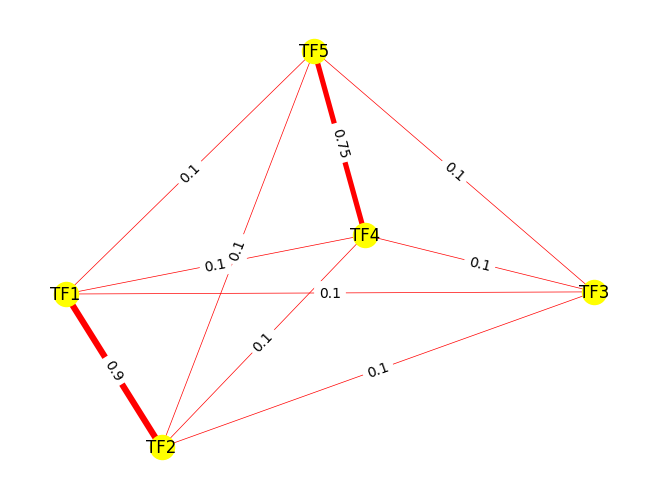
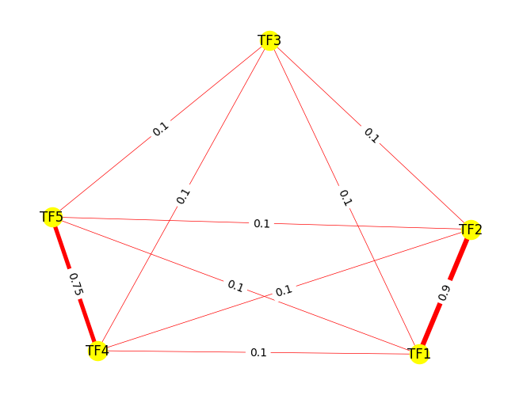
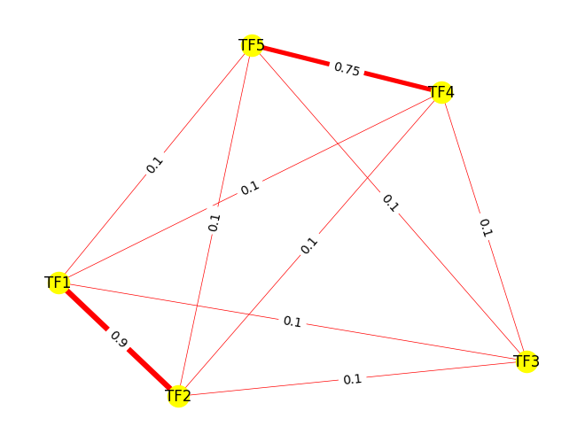

<!-- ---
layout: default
---

 -->

# GRegulNet

## Gene Regular(ized/atory) Network

#### By: Saniya Khullar, Xiang Huang, Daifeng Wang
##### Daifeng Wang Lab

## Summary

GRegulNet is a software package that utilizes network-constrained regularization for biological applications and other network-based learning tasks. In biology, traditional regression methods can struggle with correlated predictors, particularly transcription factors (TFs) that regulate target genes in gene regulatory networks (GRNs). GRegulNet incorporates information from prior biological networks to improve predictions and identify complex and non-linear relationships between predictors. This approach can highlight important nodes and edges in the network, provide insight into underlying biological processes, and improve model accuracy and biological/clinical significance. GRegulNet can incorporate multiple types of network data, including PPI networks, GRNs, gene co-expression networks, and metabolic networks.

<!-- In summary, network-constrained regularization may bolster the construction of more accurate and interpretable models that incorporate prior knowledge of the network structure among predictors. -->

## Pipeline

*Pipeline image of Gregulnet*

## Hardware Requirements

The analysis is based on Python 3.10.6. Please note that larger prior graph networks may require more memory, space, and time. We anticipate that you would only need a standard computer with enough RAM to support the operations. A Linux system with 32 GB RAM and 32GB storage would be enough to support GRegulNet. 

## Software Requirements

Please ensure you have cloned or downloaded our GRegulNet Github code and package. Please run the following command in the terminal or command prompt window to install the packages (and respective package versions and other dependencies) specified in our *requirements.txt* file: **pip install -r requirements.txt**
In short, we need to import the following Python packages to run our code: *matplotlib.pyplot, networkx, numpy, numpy.typing, os, pandas, plotly.express, random, scipy, sklearn, sys, tqdm, warnings*. To install these packages manually, please run *pip install [package]* or *pip3 install [package]* in the terminal or run *conda install [package]* in the Anaconda navigator prompt.

## Description of GRegulNet pipeline function: geneRegulatNet

Please note that our package, GRegulNet, is run by the following function **geneRegulatNet** in Python. We input an edge list of the prior graph network (constrains the model via network-based regularization) and a beta_network_val ($\beta_{network} \geq 0$, which scales the network-based regularization penalty). The user may specify the alpha_lasso_val ($\alpha_{lasso} \geq 0$) manually for the lasso regularization on the overall model (if *cv_for_alpha_lasso = False*) or GRegulNet may select an optimal $\alpha_{lasso}$ based on cross-validation (CV) on the training data (if *cv_for_alpha_lasso = True*). Then, **geneRegulatNet** builds an estimator object from the class GRegulNet that can then take in input $X$ and $y$ data: transforms them to $\tilde{X}$ and $\tilde{y}$, respectively, and use them to fit a Lasso regression model with a regularization value of $\alpha_{lasso}$. Ultimately, the trained GRegulNet model is more reflective of an underlying network structure among predictors and may be more biologically meaningful and interpretable. 

geneRegulatNet(<br>
                edge_list,<br> 
                beta_network_val, <br>
                cv_for_alpha_lasso = False,<br> 
                alpha_lasso_val = 0.1, <br>
                edge_values_for_degree = False, <br>
                consider_self_loops = False, <br>
                pseudocount_for_degree = 1e-3, <br>
                default_edge_weight = 0.1, <br>
                square_root_weights_for_degree = False, <br> squaring_weights_for_degree = False,<br> 
                threshold_for_degree = 0.5, <br>
                num_cv_folds = 5, <br>
                model_type = "Lasso", <br>
                use_network = True,<br>
                fit_y_intercept_bool = False, <br>
                max_lasso_iterations = 10000<br>
                )<br>

<!-- has 2 options with respect to the alpha_lasso_val ($\alpha_{lasso} \geq 0$) for the lasso regularization on the overall model: 
* default: the user may specify $\alpha_{lasso}$ manually (if *cv_for_alpha_lasso_model_bool = False*). If no alpha_lasso_val is specified, 0.1 will be used. 
* alternative: the user may opt for GRegulNet to select $\alpha_{lasso}$ based on cross-validation (CV) on training data (if *cv_for_alpha_lasso_model_bool = True*) -->

<!-- Ultimately, this function uses a prior network edge list and $\beta_{network}$ to build an estimator object from the class GRegulNet. This estimator can then take in input $X$ and $y$ data:  transforms them to $\tilde{X}$ and $\tilde{y}$, respectively, and use them to fit a Lasso regression model with a regularization value of $\alpha_{lasso}$. Overall, the trained model is more reflective of an underlying network structure among predictors and may be more biologically meaningful and interpretable.  -->


<!-- $$
\begin{cases}
  \text{geneRegulatNet(edge_list, } \beta_{network}, \text{cv_for_alpha_lasso_model_bool = } False, \alpha_{lasso}\text{)} & \text{if cv_for_alpha_lasso_model_bool = } False \\
  \text{geneRegulatNet(edge_list, } \beta_{network}, \text{cv_for_alpha_lasso_model_bool = } True) & \text{if cv_for_alpha_lasso_model_bool = } True \\
\end{cases}
$$

There are several additional parameters that can be adjusted in the geneRegulatNet function, which will be explained later in the *Default Parameters* section.  -->

<!-- ### Main Input: -->

<!-- * *edge_list*: A list of lists corresponding to a prior network involving the predictors (as nodes) and relationships among them as edges. We will utilize this prior network to constrain our machine learning model. For instance, this could be a Protein-Protein Interaction (PPI) network of interactions among the predictors. If  weights are missing for any edge, then the default_weight will be used for that respective edge. We assume that this network is undirected and thereby symmetric, so the user only needs to specify edges in 1 direction (and the other direction will be assumed automatically). 

For instance:

[[source<sub>1</sub>, target<sub>1</sub>, weight<sub>1</sub>], [source<sub>2</sub>, target<sub>2</sub>, weight<sub>2</sub>], ..., [source<sub>Z</sub>, target<sub>Z</sub>, weight<sub>Z</sub>]]. 

Where weight<sub>1</sub>, weight<sub>2</sub>, ..., weight<sub>Z</sub> are optional. If an edge is missing its respective edge weight, then the default edge weights will be utilized. 

The edge_list will be represented by:

| Source | Target |  Weight |
| --------- | ---------- | ---------- |
|source<sub>1</sub>   | target<sub>1</sub> | weight<sub>1</sub>|
|source<sub>2</sub>   | target<sub>2</sub> | weight<sub>2</sub> |
|...    | ... | ... |
|source<sub>Z</sub>    | target<sub>Z</sub> | weight<sub>Z</sub>|
|target<sub>1</sub>   | source<sub>1</sub> | weight<sub>1</sub> |
|target<sub>2</sub>    | source<sub>2</sub> | weight<sub>2</sub> |
|...    | ... | ... |
|target<sub>Z</sub>    | source<sub>Z</sub> | weight<sub>Z</sub> | -->

<!-- * *beta_network_val*:  A numerical value for $\beta_{network} \geq 0$.  -->

<!-- * *cv_for_alpha_lasso_model_bool*:
  - False (default): user wants to specify the value of $\alpha_{lasso}$
  - True: GRegulNet will perform cross-validation (CV) on training data to determine optimal $\alpha_{lasso}$ -->

<!-- $$ = \begin{cases}
  \text{if cv_for_alpha_lasso_model_bool = } False & \text{default: user wants to specify the value of }  \alpha_{lasso}  \\
  \text{if cv_for_alpha_lasso_model_bool = } True & \text{GRegulNet will perform cross-validation (CV) on training data to determine optimal } \alpha_{lasso} \\
\end{cases}
$$ -->

<!-- $$ = \begin{cases}
  \text{if cv_for_alpha_lasso_model_bool = } False & \text{default: user wants to specify the value of }  \alpha_{lasso}  \\
  \text{if cv_for_alpha_lasso_model_bool = } True & \text{GRegulNet will perform cross-validation (CV) on training data to determine optimal } \alpha_{lasso} \\
\end{cases}
$$ -->


<!-- ##### If *cv_for_alpha_lasso_model_bool* is False, we need to specify alpha_lasso_val $\alpha_{lasso}$ ##### -->

<!-- * *alpha_lasso_val*:  A numerical value for $\alpha_{lasso} \geq 0$. If *cv_for_alpha_lasso_model_bool* is False, the user is then advised to specify this $\alpha_{lasso}$ parameter (alpha_lasso_val). Otherwise, if no $\alpha_{lasso}$ value is specified, then the default value of $\alpha_{lasso} = 0.1$ will be used.  -->

### Main Inputs (Arguments):

<!-- | Parameter | Definition | Default |
| --------- | ---------- | ---------- |
| edge_list       | list of lists: [[source<sub>1</sub>, target<sub>1</sub>, weight<sub>1</sub>], ..., [source<sub>Z</sub>, target<sub>Z</sub>, weight<sub>Z</sub>]] | value needed |
| $\beta_{network}$  | Regularization parameter for network penalization | value needed |
| cv_for_alpha_lasso_model_bool  | Should GRegulNet perform Cross Validation to determine $\alpha_{lasso}$  | False |
| $\alpha_{lasso}$  | Regularization parameter for lasso | value needed if cv_for_alpha_lasso_model_bool = False; default: 0.1 | -->


| Parameter | Definition | 
| --------- | ---------- | 
| edge_list       | A list of lists corresponding to a prior network involving predictors (nodes) and relationships among them (edges): [[source<sub>1</sub>, target<sub>1</sub>, weight<sub>1</sub>], ..., [source<sub>Z</sub>, target<sub>Z</sub>, weight<sub>Z</sub>]]. Here, weight<sub>1</sub>, ..., weight<sub>Z</sub> are optional. | 
| beta_network_val: $\beta_{network}$  | Regularization parameter for network penalization: $\beta_{network} \geq 0$. | 
| cv_for_alpha_lasso | * False (default): user wants to specify the value of $\alpha_{lasso}$ <br> * True: GRegulNet will perform cross-validation (CV) on training data to determine optimal $\alpha_{lasso}$  | 
| alpha_lasso_val: $\alpha_{lasso}$  | A numerical regularization parameter for lasso needed if cv_for_alpha_lasso_model_bool = False: $\alpha_{lasso} \geq 0$. |
 


<!-- | Parameter | Definition | More information |
| --------- | ---------- | ---------- |
| edge_list       | A list of lists corresponding to a prior network involving predictors (nodes) and relationships among them (edges): [[source<sub>1</sub>, target<sub>1</sub>, weight<sub>1</sub>], ..., [source<sub>Z</sub>, target<sub>Z</sub>, weight<sub>Z</sub>]]. Here, weight<sub>1</sub>, ..., weight<sub>Z</sub> are optional. | This prior network constrains our model. We assume that this network is undirected and thereby symmetric, so the user only needs to specify edges in 1 direction (and other directions are assumed automatically). The default edge weight is utilized for any edge with a missing edge weight.|
| beta_network_val: $\beta_{network}$  | Regularization parameter for network penalization: $\beta_{network} \geq 0$. | Value needed, which scales the strength of network penalization |
| cv_for_alpha_lasso_model_bool  | Should GRegulNet perform Cross Validation to determine $\alpha_{lasso}$? | Default boolean value: False. <br>* False (default): user wants to specify the value of $\alpha_{lasso}$ <br> * True: GRegulNet will perform cross-validation (CV) on training data to determine optimal $\alpha_{lasso}$  |
| alpha_lasso_val: $\alpha_{lasso}$  | A numerical regularization parameter for lasso: $\alpha_{lasso} \geq 0$. | Value needed if cv_for_alpha_lasso_model_bool = False; default: 0.1 |
  -->
### Default Parameters: ###

Please note these parameters that can be adjusted as needed for user needs and specifications. 

* Parameters for the graph prior network:

| Parameter | Definition | 
| --------- | ---------- | 
| default_edge_weight  | Weight assigned to any edge with missing weight | 
| consider_self_loops  | True: Add 1 to each degree (for self-loops)| 
| pseudocount_for_degree  | Pseudocount to add for each degree (node). 
| edge_values_for_degree  | True: edge weights used for node degree; False: threshold used | default: False|
| threshold_for_degree  | Edges with weight > threshold_for_degree are counted as 1 towards node degree (if *edge_values_for_degree is False*) |
| square_root_weights_for_degree  | Sum $\sqrt{w}$ for a given node degree (if *edge_values_for_degree is True*) |
| squaring_weights_for_degree  | Sum $w^{2}$ for a given node degree (if *edge_values_for_degree is True*) |

* Parameters for the network-based regularized model:

| Parameter | Definition | 
| --------- | ---------- | 
| use_network  | If False, we fit a Lasso model on original $X$ and $y$ data (baseline). | 
| fit_y_intercept_bool  | Should a y-intercept be fitted for the final model by GRegulNet | 
| max_lasso_iterations  | the maximum # of iterations we will run Lasso regression model (if *cv_for_alpha_lasso_model_bool is False*) |
| num_cv_folds  | the # of cross-validation (cv) folds we fit on training data when building model (if *cv_for_alpha_lasso is True*) |


### Output: ###

* An GRegulNet network-regularized linear model object from the GRegulNet class. We can fit our GRegulNet estimator object on $X$ and $y$ training data and retrieve coefficients. Then, we can evaluate our model performance capabilities on testing data using the Mean Squared Error (MSE). 

## Demo (Toy Example) of GRegulNet:

Suppose we want to build a machine learning model to predict the gene expression level of our target gene (TG) $y$ based on the expression levels of 5 Transcription Factors (TFs): [TF<sub>1</sub>, $TF_{2}$, $TF_{3}$, $TF_{4}$, $TF_{5}$], which are our respective predictors [X<sub>1</sub>, $X_{2}$, $X_{3}$, $X_{4}$, $X_{5}$]. Our GRegulNet estimator also incorporates an **undirected prior graph network** of biological relationships among our 5 TFs based on a Protein-Protein Interaction (PPI) network. 
<!-- There is a particularly strong relationship between $TF_{1} \leftrightarrow TF_{2}$ of 0.9 and between $TF_{4} \leftrightarrow TF_{5}$ of 0.75. The remaining relationships among the other TFs is assumed to be the default (edge weight of 0.1). -->

```python
from gregulnetClasses import * # to load our package, GRegulNet
edge_list = [[1, 2, 0.9], [4, 5, 0.75], [1, 3], [1, 4], [1, 5], 
              [2, 3], [2, 4], [2, 5], [3, 4], [3, 5]]
beta_network_val = 10
# by default, cv_for_alpha_lasso_model_bool is False, so alpha_lasso_val will be specified.
alpha_lasso_val = 0.01

# Building the network regularized regression model. 
gregulnet_demo = geneRegulatNet(edge_list = edge_list, beta_network_val = beta_network_val,
                          alpha_lasso_val = alpha_lasso_val)
```
    :) Please note that we count the number of edges with weight > 0.5 to get the degree for a given node.
    :) We also add 0.001 as a pseudocount to our degree value for each node.
    
  
<!--  -->


Here, we use the *DemoDataBuilderXandY* class to generate 100 samples of random $X$ and $y$ data to train our GRegulNet object. Further, we want the Pearson correlations ($r$) of each predictor with the $y$ variable as provided by *corrVals*: [cor(TF<sub>1</sub>, $y$) = 0.9, cor(TF<sub>2</sub>, $y$) = 0.5, cor(TF<sub>3</sub>, $y$) = 0.1, cor(TF<sub>4</sub>, $y$) = -0.2, cor(TF<sub>5</sub>, $y$) = -0.8]. Since *same_train_test_data* is False, we partition the data with 70% for training and 30% for testing. More details about this class (and additional parameters we can adjust for) are in *Demo_Data_Example.ipynb*.

```python
demo_dict = {"num_samples_M": 100,
            "corrVals": [0.9, 0.5, 0.1, -0.2, -0.8],
            "same_train_test_data": False}

dummy_data = DemoDataBuilderXandY(**demo_dict)

X_train = dummy_data.X_train
y_train = dummy_data.y_train
```


Here, $gregulnet_{demo}$, is an object of the *GRegulNet* class. We fit a model using the $X_{train}$ and $y_{train}$ data sets.


```python
gregulnet_demo.fit(X_train, y_train)
```

    network used
    Training GRegulNet :)
    <gregulnetClasses.GRegulNet at 0x215f0fa2200>


To view and extract the predicted model coefficients for the predictors: 

```python
gregulnet_demo.coef
```


    array([ 0.23655573,  0.11430656,  0.00148755, -0.03512912, -0.16009479])


```python
gregulnet_demo.model_coefficients_df
```


<div>
<table border="1" class="dataframe">
  <thead>
    <tr style="text-align: right;">
      <th></th>
      <th>y_intercept</th>
      <th>TF1</th>
      <th>TF2</th>
      <th>TF3</th>
      <th>TF4</th>
      <th>TF5</th>
    </tr>
  </thead>
  <tbody>
    <tr>
      <th>0</th>
      <td>None</td>
      <td>0.236556</td>
      <td>0.114307</td>
      <td>0.001488</td>
      <td>-0.035129</td>
      <td>-0.160095</td>
    </tr>
  </tbody>
</table>
</div>


We can test the performance of our data on testing data, to understand better the generalizability of our GRegulNet model on new, unseen, data. 


```python
y_test = dummy_data.y_test 
X_test = dummy_data.X_test

mse_test = gregulnet_demo.predict(X_test, y_test)
print(f"Please note that the testing Mean Square Error (MSE) is {mse_test}")
```

    Testing GRegulnet :)
    Please note that the testing Mean Square Error (MSE) is 0.020152051044508176
    

<!-- ### Comparison Demo: GRegulNet versus Baseline Model for Cross-Validation Alpha Lasso

We will use the same $X_{train}$, $y_{train}$, $X_{test}$, and $y_{test}$ data and same prior network here to compare illustrate the effectiveness of GRegulNet in terms of a lower testing MSE (relative to a baseline model that incorporates no prior network). For ease of comparison, we will select the optimal alpha_lasso for each model using cross validation (CV) on the training data (that is, *cv_for_alpha_lasso_model_bool* = True). This example also shows how to run **geneRegulatNet** when alpha_lasso is determined by CV. 

#### GRegulNet using Cross validation for Alpha Lasso 
```python
# geneRegulatNet where alpha_lasso is determined by cross-validation on training data: :)
gregulnet_cv_demo = geneRegulatNet(edge_list = edge_list, beta_network_val = 10,
                              alpha_lasso_val = alpha_lasso_val, 
                              cv_for_alpha_lasso_model_bool = True)
gregulnet_cv_demo.fit(X_train, y_train)
print(gregulnet_cv_demo.optimal_alpha)
gregulnet_cv_mse_test = gregulnet_cv_demo.predict(X_test, y_test)
print(f"Please note that the testing Mean Square Error (MSE) for GRegulNet-CV model is {gregulnet_cv_mse_test}")
gregulnet_cv_demo.model_coefficients_df
```

    prior graph network used
    :) Please note that we count the number of edges with weight > 0.5 to get the degree for a given node.
    :) We also add 0.001 as a pseudocount to our degree value for each node.
    
    network used
    Training GRegulNet :)
    Cross-Validation optimal alpha lasso: 0.0041235620913686235
    Testing GRegulnet :)
    Please note that the testing Mean Square Error (MSE) for GRegulNet-CV model is 0.020310913421979375
    

<div>
<table border="1" class="dataframe">
  <thead>
    <tr style="text-align: right;">
      <th></th>
      <th>y_intercept</th>
      <th>TF1</th>
      <th>TF2</th>
      <th>TF3</th>
      <th>TF4</th>
      <th>TF5</th>
    </tr>
  </thead>
  <tbody>
    <tr>
      <th>0</th>
      <td>None</td>
      <td>0.236283</td>
      <td>0.116051</td>
      <td>0.001487</td>
      <td>-0.037593</td>
      <td>-0.161468</td>
    </tr>
  </tbody>
</table>
</div>

    
<!--  -->
    
<!-- 
#### Baseline Model using Cross validation for Alpha Lasso 
```python
# baseline lasso model (no prior network). Optimal alpha_lasso determined by cross-validation
# on the training data: :)
baseline_demo = geneRegulatNet(edge_list = edge_list, beta_network_val = None,
                              alpha_lasso_val = alpha_lasso_val, 
                              cv_for_alpha_lasso_model_bool = True,
                              use_network = False)

baseline_demo.fit(X_train, y_train)
print(baseline_demo.optimal_alpha)
baseline_mse_test = baseline_demo.predict(X_test, y_test)
print(f"Please note that the testing Mean Square Error (MSE) for the baseline model is {baseline_mse_test}")
baseline_demo.model_coefficients_df
```

    baseline model (no prior network)
    Cross-Validation optimal alpha lasso: 0.022006210642838385
    Please note that the testing Mean Square Error (MSE) for the baseline model is 0.1630541856987722
    
<div>
<table border="1" class="dataframe">
  <thead>
    <tr style="text-align: right;">
      <th></th>
      <th>y_intercept</th>
      <th>TF1</th>
      <th>TF2</th>
      <th>TF3</th>
      <th>TF4</th>
      <th>TF5</th>
    </tr>
  </thead>
  <tbody>
    <tr>
      <th>0</th>
      <td>None</td>
      <td>0.256041</td>
      <td>0.036381</td>
      <td>0.076338</td>
      <td>0</td>
      <td>-0.208916</td>
    </tr>
  </tbody>
</table>
</div> --> 

## References

[1]: Caiyan Li, Hongzhe Li, Network-constrained regularization and variable selection for analysis of genomic data, Bioinformatics, Volume 24, Issue 9, May 2008, Pages 1175–1182, https://doi.org/10.1093/bioinformatics/btn081

[2]: Wilkinson, M.D., Dumontier, M., Aalbersberg, I.J. et al. The FAIR Guiding Principles for scientific data management and stewardship. Sci Data 3, 160018 (2016). https://doi.org/10.1038/sdata.2016.18

[3]: Zhang, Y., Akutsu, T., & Ching, W. K. (2016). Incorporating network topology and phylogenetic constraints for protein-protein interaction prediction. BMC bioinformatics, 17(1), 1-15. https://doi.org/10.1186/s12859-016-1310-4

[4]: Jia, C., Zhang, Y., Chen, K., & Zhang, S. (2018). A novel feature extraction method with improved consistency for identifying cell cycle regulated genes. Bioinformatics, 34(5), 896-903. https://doi.org/10.1093/bioinformatics/btx657

[5]: Lu, Y., Chen, X., & Hu, Z. (2017). Recognition of protein/gene names from text using an ensemble of classifiers and effective abbreviation resolution. BMC bioinformatics, 18(1), 1-11. https://doi.org/10.1186/s12859-017-1515-1

[6]: Pedregosa, F., Varoquaux, G., Gramfort, A., Michel, V., Thirion, B., Grisel, O., ... & Vanderplas, J. (2011). Scikit-learn: Machine learning in Python. Journal of Machine Learning Research, 12(Oct), 2825-2830.
