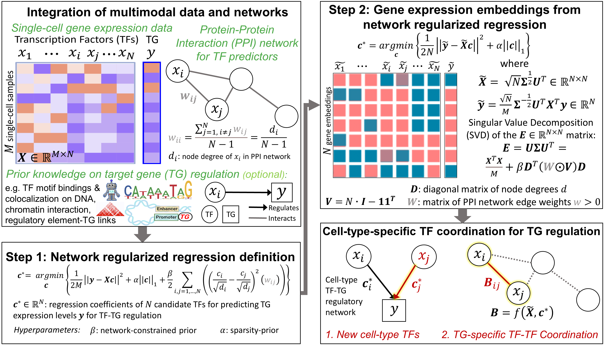
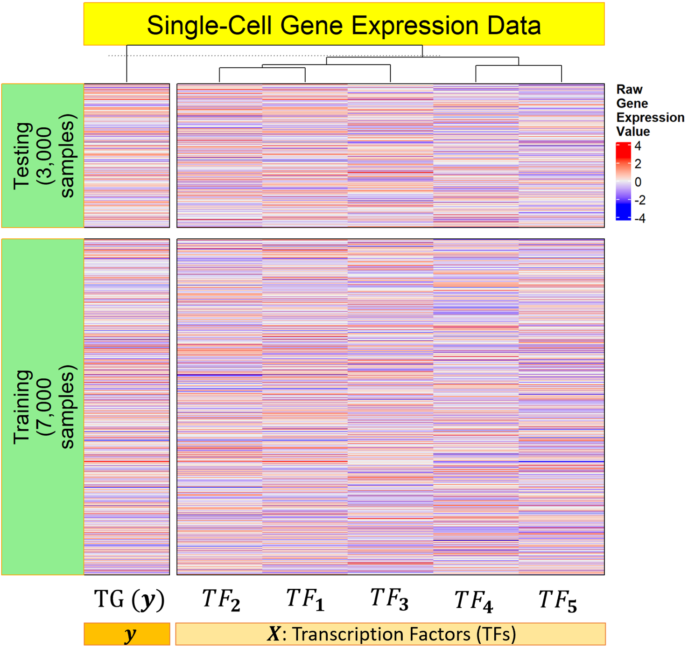
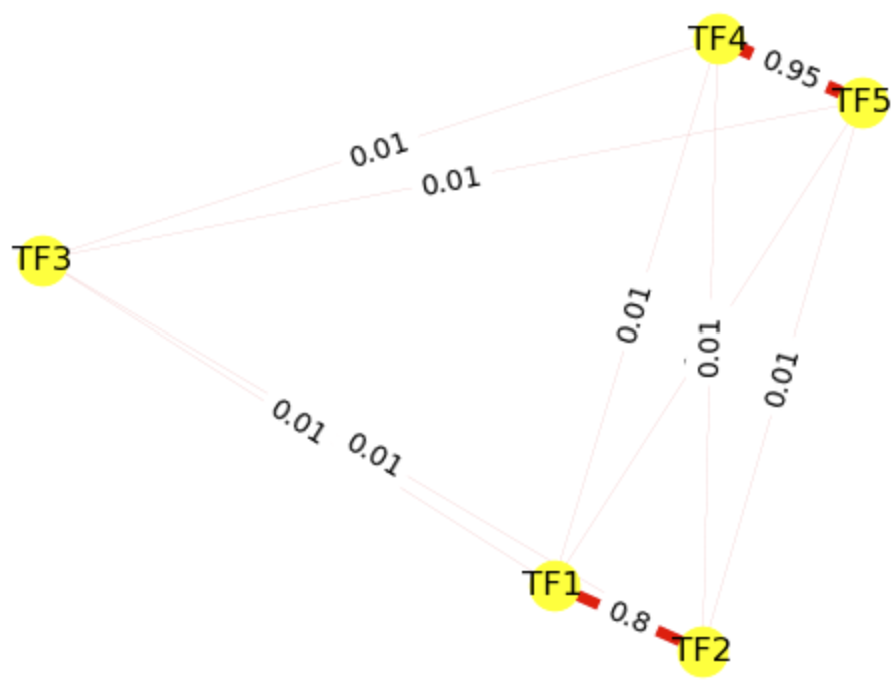
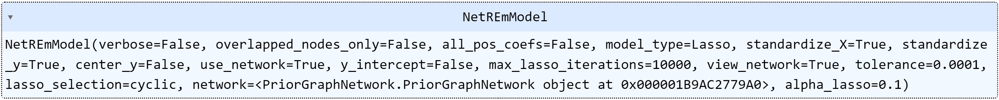
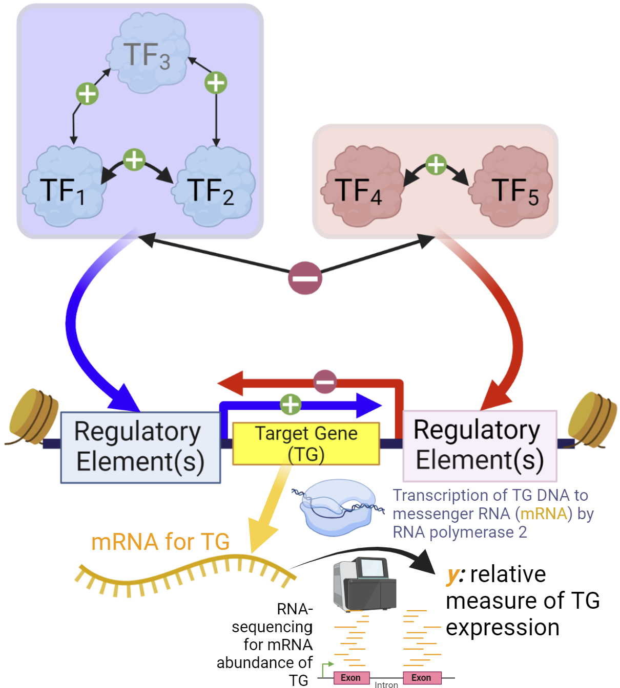

<!-- ---
layout: default
---

 -->

# NetREm
## Network regression embeddings reveal cell-type transcription factor coordination for gene regulation
<!-- ##### GRegNet Gene Regular(ized/atory) Network -->

### By: Saniya Khullar, Xiang Huang, Raghu Ramesh, John Svaren, Daifeng Wang
[Daifeng Wang Lab](https://daifengwanglab.org/) <br>

## Summary

NetREm is a software package that utilizes network-constrained regularization for biological applications and other network-based learning tasks. In biology, traditional regression methods can struggle with correlated predictors, particularly transcription factors (TFs) that regulate target genes (TGs) in gene regulatory networks (GRNs). NetREm incorporates information from prior biological networks to improve predictions and identify complex relationships among predictors (e.g. TF-TF coordination: direct/indirect interactions among TFs). This approach can highlight important nodes and edges in the network, reveal novel regularized embeddings for genes, provide insights into underlying biological processes, identify subnetworks of predictors that group together to influence the response variable, and improve model accuracy and biological/clinical significance of the models. NetREm can incorporate multiple types of network data, including Protein-Protein Interaction (PPI) networks, gene co-expression networks, and metabolic networks. In summary, network-constrained regularization may bolster the construction of more accurate and interpretable models that incorporate prior knowledge of the network structure among predictors.


<!-- GRegNet is a software package that utilizes network-constrained regularization for biological applications and other network-based learning tasks. In biology, traditional regression methods can struggle with correlated predictors, particularly transcription factors (TFs) that regulate target genes in gene regulatory networks (GRNs). GRegNet incorporates information from prior biological networks to improve predictions and identify complex relationships among predictors. This approach can highlight important nodes and edges in the network, provide insights into underlying biological processes, and improve model accuracy and biological/clinical significance of the models. GRegNet can incorporate multiple types of network data, including PPI networks, gene co-expression networks, and metabolic networks. -->

<!-- s. -->

## Pipeline

*Pipeline image of NetREm*



## Hardware Requirements

The minimum requirement is a computer with 8 GB of RAM and 32 GB of storage. For large prior graph networks, 32 GB of RAM is recommended. 

## Software Requirements and Installation Guide
The software uses Python 3.10. After downloading the NetREm Github code, conda/Anaconda users can use the following steps to install:
1. In the Anaconda navigator prompt, create a virtual environment of Python 3.10 by running:<br>
`conda create -n NetREm python=3.10`
2. Activate the environment:<br>
`conda activate NetREm`
3. Make sure to change the current directory to the NetREm folder.<!-- Saniya: This is operating system dependent, you may add command to change directory for Windows/Madc/Linux, cd for windows/Linux, what Shanw used for Windows is cd C:\C:\Users\Shawn\Code\NetREm -->
4. Install the packages and dependencies (*math, matplotlib, networkx, numpy, typing, os, pandas, plotly.express, random, scipy, scikit-optimize, scikit-learn, sys, tqdm, warnings*):<br>
`pip install -r requirements.txt`

<!-- To install these packages manually, please run *pip install [package]* or *pip3 install [package]* in the terminal or run *conda install [package]* in the Anaconda navigator prompt. -->

Please note that if you encounter import errors from files or functions in the code folder (such as `Netrem_model_builder.py`), add an empty file named __init__.py to the code folder, and add the "code." prefix to all imports from the "code" folder. For example, `import Netrem_model_builder as nm` :arrow_right: `import code.Netrem_model_builder as nm`.


<br>

## Usage of the NetREm main function netrem()
NetREm fits a Network-constrained Lasso regression machine learning model with user-provided weights for the prior network.  Here, **netrem** is the main function with the following usage:
<!-- For biological applications, it is recommended that the user ensure network names map to gene expression names -->
<!-- SHould we have 2 arguments? 1 for default_edge_weight for nodes found in network. default_weight_prior_edges: for any edge in the edge_list that has an unknown weight, we provide this edge_weight. Thus, we are prioritizing edges provided in the edgelist over those not found in the edge_list originally. Then we can show that since we skipped out on sharing an edge, the code automatically added in an edge with lower edge weight.  
default_weight_new_edges. -->
**netrem**(<br> 
    &nbsp;&nbsp;&nbsp;&nbsp;&nbsp;&nbsp;&nbsp;&nbsp;*edge_list*, <br>
    &nbsp;&nbsp;&nbsp;&nbsp;&nbsp;&nbsp;&nbsp;&nbsp;*beta_net = 1*, <br>
    &nbsp;&nbsp;&nbsp;&nbsp;&nbsp;&nbsp;&nbsp;&nbsp;*alpha_lasso = 0.01*, <br>
    &nbsp;&nbsp;&nbsp;&nbsp;&nbsp;&nbsp;&nbsp;&nbsp;*default_edge_weight = 0.01*,<br>
    &nbsp;&nbsp;&nbsp;&nbsp;&nbsp;&nbsp;&nbsp;&nbsp;*edge_vals_for_d = True*,<br>
    &nbsp;&nbsp;&nbsp;&nbsp;&nbsp;&nbsp;&nbsp;&nbsp;*w_transform_for_d = "none"*,<br>
    &nbsp;&nbsp;&nbsp;&nbsp;&nbsp;&nbsp;&nbsp;&nbsp;*degree_threshold = 0.5*,<br>
    &nbsp;&nbsp;&nbsp;&nbsp;&nbsp;&nbsp;&nbsp;&nbsp;*gene_expression_nodes = []*,<br>
    &nbsp;&nbsp;&nbsp;&nbsp;&nbsp;&nbsp;&nbsp;&nbsp;*overlapped_nodes_only = False*,<br>
    &nbsp;&nbsp;&nbsp;&nbsp;&nbsp;&nbsp;&nbsp;&nbsp;*y_intercept = False*, <br>
    &nbsp;&nbsp;&nbsp;&nbsp;&nbsp;&nbsp;&nbsp;&nbsp;*view_network = False*, <br>
    &nbsp;&nbsp;&nbsp;&nbsp;&nbsp;&nbsp;&nbsp;&nbsp;*model_type = "Lasso"*,<br>
    &nbsp;&nbsp;&nbsp;&nbsp;&nbsp;&nbsp;&nbsp;&nbsp;...<br>
)
<!-- degree_pseudocount = 1e-3,<br> -->

<!-- has 2 options with respect to the alpha_lasso_val ($\alpha_{lasso} \geq 0$) for the lasso regularization on the overall model: 
* default: the user may specify $\alpha_{lasso}$ manually (if *cv_for_alpha_lasso_model_bool = False*). If no alpha_lasso_val is specified, 0.1 will be used. 
* alternative: the user may opt for GRegulNet to select $\alpha_{lasso}$ based on cross-validation (CV) on training data (if *cv_for_alpha_lasso_model_bool = True*) -->

<!-- Ultimately, this function uses a prior network edge list and $\beta_{network}$ to build an estimator object from the class GRegulNet. This estimator can then take in input $X$ and $y$ data:  transforms them to $\tilde{X}$ and $\tilde{y}$, respectively, and use them to fit a Lasso regression model with a regularization value of $\alpha_{lasso}$. Overall, the trained model is more reflective of an underlying network structure among predictors and may be more biologically meaningful and interpretable.  -->


<!-- $$
\begin{cases}
  \text{geneRegulatNet(edge_list, } \beta_{network}, \text{cv_for_alpha_lasso_model_bool = } False, \alpha_{lasso}\text{)} & \text{if cv_for_alpha_lasso_model_bool = } False \\
  \text{geneRegulatNet(edge_list, } \beta_{network}, \text{cv_for_alpha_lasso_model_bool = } True) & \text{if cv_for_alpha_lasso_model_bool = } True \\
\end{cases}
$$

There are several additional parameters that can be adjusted in the geneRegulatNet function, which will be explained later in the *Default Parameters* section.  -->

<!-- ### Main Input: -->

<!-- * *edge_list*: A list of lists corresponding to a prior network involving the predictors (as nodes) and relationships among them as edges. We will utilize this prior network to constrain our machine learning model. For instance, this could be a Protein-Protein Interaction (PPI) network of interactions among the predictors. If  weights are missing for any edge, then the default_weight will be used for that respective edge. We assume that this network is undirected and thereby symmetric, so the user only needs to specify edges in 1 direction (and the other direction will be assumed automatically). 

For instance:

[[source<sub>1</sub>, target<sub>1</sub>, weight<sub>1</sub>], [source<sub>2</sub>, target<sub>2</sub>, weight<sub>2</sub>], ..., [source<sub>Z</sub>, target<sub>Z</sub>, weight<sub>Z</sub>]]. 

Where weight<sub>1</sub>, weight<sub>2</sub>, ..., weight<sub>Z</sub> are optional. If an edge is missing its respective edge weight, then the default edge weights will be utilized. 

The edge_list will be represented by:

| Source | Target |  Weight |
| --------- | ---------- | ---------- |
|source<sub>1</sub>   | target<sub>1</sub> | weight<sub>1</sub>|
|source<sub>2</sub>   | target<sub>2</sub> | weight<sub>2</sub> |
|...    | ... | ... |
|source<sub>Z</sub>    | target<sub>Z</sub> | weight<sub>Z</sub>|
|target<sub>1</sub>   | source<sub>1</sub> | weight<sub>1</sub> |
|target<sub>2</sub>    | source<sub>2</sub> | weight<sub>2</sub> |
|...    | ... | ... |
|target<sub>Z</sub>    | source<sub>Z</sub> | weight<sub>Z</sub> | -->

<!-- * *beta_network_val*:  A numerical value for $\beta_{network} \geq 0$.  -->

<!-- * *cv_for_alpha_lasso_model_bool*:
  - False (default): user wants to specify the value of $\alpha_{lasso}$
  - True: GRegulNet will perform cross-validation (CV) on training data to determine optimal $\alpha_{lasso}$ -->

<!-- $$ = \begin{cases}
  \text{if cv_for_alpha_lasso_model_bool = } False & \text{default: user wants to specify the value of }  \alpha_{lasso}  \\
  \text{if cv_for_alpha_lasso_model_bool = } True & \text{GRegulNet will perform cross-validation (CV) on training data to determine optimal } \alpha_{lasso} \\
\end{cases}
$$ -->

<!-- $$ = \begin{cases}
  \text{if cv_for_alpha_lasso_model_bool = } False & \text{default: user wants to specify the value of }  \alpha_{lasso}  \\
  \text{if cv_for_alpha_lasso_model_bool = } True & \text{GRegulNet will perform cross-validation (CV) on training data to determine optimal } \alpha_{lasso} \\
\end{cases}
$$ -->


<!-- ##### If *cv_for_alpha_lasso_model_bool* is False, we need to specify alpha_lasso_val $\alpha_{lasso}$ ##### -->

<!-- * *alpha_lasso_val*:  A numerical value for $\alpha_{lasso} \geq 0$. If *cv_for_alpha_lasso_model_bool* is False, the user is then advised to specify this $\alpha_{lasso}$ parameter (alpha_lasso_val). Otherwise, if no $\alpha_{lasso}$ value is specified, then the default value of $\alpha_{lasso} = 0.1$ will be used.  -->

<!-- | Parameter | Definition | Default |
| --------- | ---------- | ---------- |
| edge_list       | list of lists: [[source<sub>1</sub>, target<sub>1</sub>, weight<sub>1</sub>], ..., [source<sub>Z</sub>, target<sub>Z</sub>, weight<sub>Z</sub>]] | value needed |
| $\beta_{network}$  | Regularization parameter for network penalization | value needed |
| cv_for_alpha_lasso_model_bool  | Should GRegulNet perform Cross Validation to determine $\alpha_{lasso}$  | False |
| $\alpha_{lasso}$  | Regularization parameter for lasso | value needed if cv_for_alpha_lasso_model_bool = False; default: 0.1 | -->


| Parameter | Definition | 
| --------- | ---------- | 
| **edge_list**      | ***list*** <br> A list of lists corresponding to a prior network involving predictors (nodes) and relationships among them (edges): <br> [[source<sub>1</sub>, target<sub>1</sub>, weight<sub>1</sub>], ..., [source<sub>Z</sub>, target<sub>Z</sub>, weight<sub>Z</sub>]]. Here, weight<sub>1</sub>, ..., weight<sub>Z</sub> are optional. Nodes found in the `edge_list` are referred to as *network nodes* | 
| **beta_net** | ***float, default = 1*** <br> Regularization parameter for network penalization: $\beta_{net} \geq 0$. | 
| **alpha_lasso**  | ***float, default = 0.01*** <br> A numerical regularization parameter for the lasso term ($\alpha_{lasso} \geq 0$) needed if `model_type = LassoCV`. Larger values typically reduce the number of final predictors in the model. |
| **default_edge_weight**  | ***float, default = 0.01*** <br>  Default edge weight ($w$) assigned to any edge with missing weight | 
| **edge_vals_for_d**  | ***boolean, default = True*** <br>  If True, we focus on summing the edge weights to calculate the node degree $d$ | 
| **w_transform_for_d**  |  ***string, default = "none"*** <br>  Other options are "sqrt", "square", "avg". Here, "none" means we add the weights of the edges that are connected to the node to get the node degree. These other options represent transformations that can be done on this sum to yield various other node degree values $d$ |
| **degree_threshold**  |  ***float, default = 0.5*** <br>  If *edge_vals_for_d* is False, then Edges with weight $w$ > degree_threshold are counted as 1 towards the node degree $d$ |
| **gene_expression_nodes**      | ***list, default = []*** <br> A list of predictors (e.g. TFs) to use that typically is found as columns in the training gene expression data $X_{train}$. <br> Any `gene_expression_nodes` not found in the `edge_list` are added internally into the network prior `edge_list` using pairwise `default_edge_weight`. Specifying `gene_expression_nodes` is *optional* but may boost the speed of training and fitting NetREm models (by adjusting the network prior in the beginning). Thus, if the gene expression data ($X$) is available, it is recommended to input `gene_expression_nodes`. Otherwise, NetREm  automatically determines `gene_expression_nodes` when fitting the model with $X_{train}$ gene expression data (when *fit(X,y)* is called), but needs time to recalibrate the network prior based on $X_{train}$ nodes and value set for `overlapped_nodes_only`. |
| **overlapped_nodes_only**      | ***boolean, default = False*** <br> This determines if NetREm should focus on common nodes found in *network nodes* (from `edge_list`) and gene expression data (based on `gene_expression_nodes`). Here, *network nodes* not found in the gene expression data will always be removed. The priority is given to `gene_expression_nodes` since those have gene expression values that are used by the regression. <br> • If `overlapped_nodes_only = False`, the predictors will come from `gene_expression_nodes`, even if those are not found in the network `edge_list`. Some predictors may lack relationships in the prior network. <br> • If `overlapped_nodes_only = True`, the predictors used will need to be a common node: *network node* also found in the `gene_expression_nodes`. <br> See [overlapped_nodes_only.pdf](https://github.com/SaniyaKhullar/NetREm/blob/main/user_guide/overlapped_nodes_only.pdf) for hands-on examples. | 
| **standardize_X**      | ***boolean, default = True*** <br> This determines if NetREm should standardize $X$, for each predictor column: subtracting the mean of $X$ and dividing by the standard deviation of $X$ using the training data. <br> | 
| **standardize_y**      | ***boolean, default = True*** <br> This determines if NetREm should standardize $y$: subtracting the mean of $y$ and dividing by the standard deviation of $y$ using the training data. <br> | 
| **center_y**      | ***boolean, default = False*** <br> This determines if NetREm should center $y$: subtracting the mean of $y$ based on the training data  <br> | 
| **y_intercept** | ***boolean, default = 'False'*** <br> This is the `fit_intercept` parameter found in the [Lasso](https://scikit-learn.org/stable/modules/generated/sklearn.linear_model.Lasso.html) and [LassoCV](https://scikit-learn.org/stable/modules/generated/sklearn.linear_model.LassoCV.html) classes in sklearn. <br> • If `y_intercept = True`, the model will be fit with a y-intercept term included. <br> • If `y_intercept = False`, the model will be fit with no y-intercept term. | 
| **view_network**  |  ***boolean, default = False*** <br>  • If `view_network = True`, then NetREm outputs visualizations of the prior graph network. Recommended for small networks (instead of for dense hairballs) <br> If `view_network = False`, then NetREm saves time by not outputting visuals of the network.  |
| **model_type** | ***{'Lasso', 'LassoCV'}, default = 'Lasso'*** <br> • Lasso: user specifies value of $\alpha_{lasso}$ <br> • LassoCV: NetREm performs cross-validation (CV) on training data to determine optimal $\alpha_{lasso}$  | 
| **... (additional parameters)** |Read more in the [User Guide: Additional Parameters](https://github.com/SaniyaKhullar/NetREm/blob/main/user_guide/Additional_NetREm_Parameters.md) for more parameters after **model_type** |


### Details:

We input an edge list of the prior graph network (constrains the model via network-based regularization) and a beta_net ($\beta_{net} \geq 0$, which scales the network-based regularization penalty). The user may specify the alpha_lasso ($\alpha_{lasso} \geq 0$) manually for the lasso regularization on the overall model (if `model_type = Lasso`) or NetREm may select an optimal $\alpha_{lasso}$ based on cross-validation (CV) on the training data (if `model_type = LasssoCV`). Then, **netrem** builds an estimator object from the class Netrem that can then take in input $X$ and $y$ data: transforms them to $\tilde{X}$ and $\tilde{y}$, respectively, and use them to fit a Lasso regression model with a regularization value of $\alpha_{lasso}$. Ultimately, the trained NetREm machine learning model is more reflective of an underlying network structure among predictors and may be more biologically meaningful and interpretable. Nonetheless, NetREm could be applied in various contexts where a network structure is present among the predictors. Input networks are typically weighted and undirected. We provide details, functions, and help with converting directed networks to undirected networks (of similarity values among nodes) [here](https://github.com/SaniyaKhullar/NetREm/blob/main/user_guide/directed_to_undirected_network_example.ipynb). 


### Output:

* A NetREm network-regularized linear model estimator object from the NetREmModel class.


<br> 

## Usage of the NetREmModel object returned from netrem()

### Methods:
| &nbsp;&nbsp;&nbsp;&nbsp;&nbsp;&nbsp;&nbsp;Method&nbsp;&nbsp;&nbsp;&nbsp;&nbsp;&nbsp;| Definition | Returns |
| --------------- |  ---------- |  ---------- | 
| **fit($X$, $y$)** |  Building and training the NetREm model with $X$ and $y$ data. | Fitted NetREm Object with several updated attributes. For instance, if `model_type = LassoCV`, will also return optimal value for $\alpha_{lasso}$. |
| **predict($X$)** | Use our model to predict values for our response variable $y$. Numpy array of $\hat{y}$ predicted values for $y$ |  Numpy array of $\hat{y}$ predicted values for $y$ | 
| **test_mse($X$, $y$)** | Evaluate our model performance capabilities on testing data using Mean Squared Error (MSE) as our metric.  | Numeric value corresponding to the Mean Square Error (MSE). <br>  $$MSE = \frac{1}{m} \sum_{i=1}^m (y_i - \hat{y_i})^2$$ | 

We assume that our $X$ and $y$ data correspond to $M$ samples and $N$ predictors. For biological applications, the $X$ data would typically be gene expression data (bulk or single-cell) for the $N$ candidate predictors (usually Transcription Factors (TFs)) for the $M$ samples. Then, the $y$ values would correspond to the gene expression values for the target gene (TG) $y$ for those same $M$ samples. 
| Parameter | Definition | 
| --------- | ---------- | 
| $X$ | [Pandas](https://pandas.pydata.org/) dataframe ($M$ rows by $N$ columns) where the rows are samples and columns are predictors.  | 
| $y$ | [Pandas](https://pandas.pydata.org/) dataframe ($M$ rows by 1 column) with 1 column that corresponds to values for the response variable for the same samples found in $X$. | 


We can retrieve our model coefficients and other attributes by calling these outputs:

| Output | Definition | 
| --------- | ---------- | 
| model_coef_df  | [Pandas](https://pandas.pydata.org/) dataframe of the Lasso model coefficients for all of the predictors and y-intercept (if `y_intercept = True`) | 
| model_nonzero_coef_df  | Filtered [Pandas](https://pandas.pydata.org/) dataframe of the Lasso model coefficients for only the predictors and y-intercept (if `y_intercept = True`) that have non-zero values. | 
| optimal_alpha  | If `model_type = LassoCV`, returns the optimal $\alpha_{lasso}$ found by performing cross validation (CV) on training data | 
| predY_train | NetREm's predicted values for the training response $y$ data (used to fit the model). | 
| mse_train | Mean Square Error (MSE): predicted `predY_train` versus actual training values for the response variable Y. | 
| sorted_coef_df | [Pandas](https://pandas.pydata.org/) dataframe that sorts the final model coefficients (including the y-intercept) based on their absolute values. The rank is provided from least (most important: highest absolute value coefficient) to highest (least important in model). | 
| final_corr_vs_coef_df | [Pandas](https://pandas.pydata.org/) dataframe with 3 rows. <br> • NetREm regression coefficient for predictor <br> • correlation of each predictor with y based on the training data <br> • absolute value ranking of the coefficients for the predictors |
| combined_df | [Pandas](https://pandas.pydata.org/) dataframe with a row for each predictor and several columns detailing:<br> • general NetREm model information: `y_intercept`, train MSE, `beta_net`, `alpha_lasso`, original number of predictors in $X$, filtered number of predictors input to NetREm (based on pre-processing by user), final number of non-zero predictors selected <br>• predictor-specific results: NetREm coefficient for predictor, absolute value of NetREm coefficient, rank of the absolute value of the coefficient (low ranks imply higher | NetREm coefficient | ) |


<!-- | all_params_list  | List of lists of the parameters used for NetREm model (defensive programming) | 
| network_params | List of lists of the parameters for the prior network used for NetREm model (defensive programming). <br> [] |  -->


* **predict($X$)** 

We can use our model to predict values for our response variable $y$. 

| Parameter | Definition | 
| --------- | ---------- | 
| $X$ | [Pandas](https://pandas.pydata.org/) dataframe ($M$ rows by $N$ columns) where the rows are samples and columns are predictors.  | 

<!-- | $X$ | Input numpy array matrix (list of lists) where each list corresponds to a sample. Here, rows are samples and columns are predictors. |  -->

*Returns:*
  Numpy array of $\hat{y}$ predicted values for $y$.

* **test_mse($X$, $y$)**

We can evaluate our model performance capabilities on data like testing data using the Mean Squared Error (MSE) as our metric. 

| Parameter | Definition | 
| --------- | ---------- | 
| $X$ | [Pandas](https://pandas.pydata.org/) dataframe ($M$ rows by $N$ columns) where the rows are samples and columns are predictors.  | 
| $y$ | [Pandas](https://pandas.pydata.org/) dataframe ($M$ rows by 1 column) with 1 column that corresponds to values for the response variable for the same samples found in $X$. | 


<!-- | Parameter | Definition | 
| --------- | ---------- | 
| $X$ | Numpy array matrix (list of lists) where each list corresponds to a sample. Here, rows are samples and columns are predictors. | 
| $y$ | Numpy array list for response variable with 1 value for each sample.|  -->

*Returns:*
    Numeric value corresponding to the Mean Square Error (MSE). 
  
$$ MSE = \frac{1}{m} \sum_{i=1}^m (y_i - \hat{y_i})^2 $$

=======

### Attributes:

| Attribute | Definition | 
| --------- | ---------- | 
| **model_coef_df**  | [Pandas](https://pandas.pydata.org/) dataframe of the Lasso model coefficients for all of the predictors and y-intercept (if `y_intercept = True`) | 
| **model_nonzero_coef_df**  | Filtered [Pandas](https://pandas.pydata.org/) dataframe of the Lasso model coefficients for only the predictors and y-intercept (if `y_intercept = True`) that have non-zero values. | 
| **optimal_alpha**  | If `model_type = LassoCV`, returns the optimal $\alpha_{lasso}$ found by performing cross validation (CV) on training data | 
| **predY_train** | NetREm's predicted values for the training response $y$ data (used to fit the model). | 
| **mse_train** | Mean Square Error (MSE): predicted `predY_train` versus actual training values for the response variable Y. | 
| **sorted_coef_df** | [Pandas](https://pandas.pydata.org/) dataframe that sorts the final model coefficients (including the y-intercept) based on their absolute values. The rank is provided from least (most important: highest absolute value coefficient) to highest (least important in model). | 
| **final_corr_vs_coef_df** | [Pandas](https://pandas.pydata.org/) dataframe with 3 rows. <br> • NetREm regression coefficient for predictor <br> • correlation of each predictor with y based on the training data <br> • absolute value ranking of the coefficients for the predictors |
| **combined_df** | [Pandas](https://pandas.pydata.org/) dataframe with a row for each predictor and several columns detailing:<br> • general NEtREm model information: `y_intercept`, train MSE, `beta_net`, `alpha_lasso`, original number of predictors in $X$, filtered number of predictors input to NetREm (based on pre-processing by user), final number of non-zero predictors selected <br> • predictor-specific results: NetREm coefficient for predictor, absolute value of NetREm coefficient, rank of the absolute value of the coefficient (low ranks imply higher absolute value for the NetREm coefficient) |
| **B_interaction_df** | [Pandas](https://pandas.pydata.org/) dataframe with a row for each pair of final predictors selected in the final model (with nonzero efficients) and several columns detailing the $y$-specific predictor-predictor interaction metric value:<br> • general NEtREm model information: `model_type`,  `beta_net` <br> • predictor-predictor specific results: coord_score_cs (this is the key value we focus on as it is the coordination score), original_corr (that is the same as standardized_corr), input network weight, NetREm coefficient for each predictor, novel_link (if yes, it is artifical default edge added to the input network) |
<br>

## Demo (Toy Example) of NetREm:
The goal is to build a machine learning model to predict the gene expression levels of our target gene (TG) $y$ based on the gene expression levels of $N = 5$ Transcription Factors (TFs) [TF<sub>1</sub>, $TF_{2}$, $TF_{3}$, $TF_{4}$, $TF_{5}$] in a particular cell-type. Assume the gene expression values for each TF are [X<sub>1</sub>, $X_{2}$, $X_{3}$, $X_{4}$, $X_{5}$], respectively. We generate $10,000$ random cells (rows: samples) of data where the Pearson correlations ($r$) between the gene expression of each TF ($X$) with gene expression of TG $y$ as *corrVals*: [cor(TF<sub>1</sub>, $y$) = 0.9, cor(TF<sub>2</sub>, $y$) = 0.5, cor(TF<sub>3</sub>, $y$) = 0.4, cor(TF<sub>4</sub>, $y$) = -0.3, cor(TF<sub>5</sub>, $y$) = -0.8]. We note that the `sparsity_factor_perc` is 40%, so roughly 4,000 out of the 10,000 cells for each variable will be ≈0; we incorporate these dropoout, so that the underlying data mimics single-cell expression data. Thus, $M$ is $7,000$ cells since that is what is used for training the NetREm model. 

The dimensions of $X$ are therefore 10,000 rows by 5 columns (predictors). More details about our *generate_dummy_data* function (and additional parameters we can adjust for) are in [Dummy_Data_Demo_Example.pdf](https://github.com/SaniyaKhullar/NetREm/blob/main/user_guide/Dummy_Data_Demo_Example.pdf). Our NetREm estimator also incorporates a constraint of an **undirected weighted prior graph network** of biological relationships among only 5 TFs based on a weighted Protein-Protein Interaction (PPI) network ([TF<sub>1</sub>, $TF_{2}$, $TF_{3}$, $TF_{4}$, $TF_{5}$]), where higher edge weights $w$ indicate stronger biological direct and/or indirect pairwise interactions among TFs at the protein-level. These linked TFs may be involved in several shared functions at the molecular level, such as coordinating to co-regulate shared target genes (TGs). 

Please note that the code for this demo example is [demo_toy.py](https://github.com/SaniyaKhullar/NetREm/blob/main/demo/demo_toy.py) in the *demo* folder.

```python 
from DemoDataBuilderXandY import generate_dummy_data
from Netrem_model_builder import netrem
import PriorGraphNetwork as graph
import error_metrics as em 
import essential_functions as ef
import netrem_evaluation_functions as nm_eval

num_samples = 10000 # number of samples (e.g. single-cells)
corrs_list =  [0.9, 0.5, 0.4, -0.3, -0.8] # the individual correlations (r) of each X variable with y
train_p = 70 # the % of original data we use for M
dummy_data = generate_dummy_data(corrVals = corrs_list, # the # of elements in corrVals is the # of predictors (X)
                                 num_samples_M = num_samples, # the number of samples M is: (num_samples_M)*(train_data_percent)
                                 sparsity_factor_perc = 40, # approximately what % of data for each variable is sparse (0)
                                 train_data_percent = train_p) # the remainder out of 10,000 will be kept for testing. If 100, then ALL data is used for training and testing.

```
The Python console or Jupyter notebook will  print out the following:

    same_train_test_data = False
    Please note that since we hold out 30.0% of our 100000 samples for testing, we have:
    X_train = 7,000 rows (samples) and 5 columns (N = 5 predictors) for training.
    X_test = 3,000 rows (samples) and 5 columns (N = 5 predictors) for testing.
    y_train = 7,000 corresponding rows (samples) for training.
    y_test = 3,000 corresponding rows (samples) for testing.

The $X$ data should be in the form of a Pandas dataframe as below:

```python
X_df = dummy_data.X_df
X_df.head(10) # please view the first 10 rows
```
<div>
<table border="1" class="dataframe">
  <thead>
      <tr style="text-align: right;">
      <th></th>
      <th>TF1</th>
      <th>TF2</th>
      <th>TF3</th>
      <th>TF4</th>
      <th>TF5</th>
    </tr>
  </thead>
  <tbody>
    <tr>
      <th>0</th>
      <td>0.000000</td>
      <td>1.431629</td>
      <td>0.000000</td>
      <td>0.000000</td>
      <td>0.000000</td>
    </tr>
    <tr>
      <th>1</th>
      <td>0.000000</td>
      <td>0.992102</td>
      <td>0.774417</td>
      <td>-1.464686</td>
      <td>0.000000</td>
    </tr>
    <tr>
      <th>2</th>
      <td>-0.856293</td>
      <td>0.000000</td>
      <td>-1.682493</td>
      <td>0.906734</td>
      <td>-0.557047</td>
    </tr>
    <tr>
      <th>3</th>
      <td>-0.657480</td>
      <td>1.008181</td>
      <td>0.000000</td>
      <td>1.426829</td>
      <td>-0.699446</td>
    </tr>
    <tr>
      <th>4</th>
      <td>0.000000</td>
      <td>0.000000</td>
      <td>0.000000</td>
      <td>0.000000</td>
      <td>0.000000</td>
    </tr>
    <tr>
      <th>5</th>
      <td>0.000000</td>
      <td>-1.001249</td>
      <td>0.000000</td>
      <td>0.000000</td>
      <td>1.882605</td>
    </tr>
    <tr>
      <th>6</th>
      <td>1.258316</td>
      <td>1.228853</td>
      <td>1.789500</td>
      <td>-1.373181</td>
      <td>-3.245509</td>
    </tr>
    <tr>
      <th>7</th>
      <td>1.090277</td>
      <td>0.000000</td>
      <td>0.000000</td>
      <td>1.250911</td>
      <td>-0.683330</td>
    </tr>
    <tr>
      <th>8</th>
      <td>0.666747</td>
      <td>0.000000</td>
      <td>0.654979</td>
      <td>0.573183</td>
      <td>0.000000</td>
    </tr>
    <tr>
      <th>9</th>
      <td>-3.076390</td>
      <td>-1.082092</td>
      <td>-1.573686</td>
      <td>0.742459</td>
      <td>3.025879</td>
    </tr>
  </tbody>
</table>
</div>


```python
y_df = dummy_data.y_df
y_df.head(10) # please view the first 10 rows
```


<div>
<table border="1" class="dataframe">
  <thead>
    <tr style="text-align: right;">
      <th></th>
      <th>y</th>
    </tr>
  </thead>
  <tbody>
    <tr>
      <th>0</th>
      <td>0.711674</td>
    </tr>
    <tr>
      <th>1</th>
      <td>0.000000</td>
    </tr>
    <tr>
      <th>2</th>
      <td>-1.001871</td>
    </tr>
    <tr>
      <th>3</th>
      <td>0.000000</td>
    </tr>
    <tr>
      <th>4</th>
      <td>0.000000</td>
    </tr>
    <tr>
      <th>5</th>
      <td>-1.141293</td>
    </tr>
    <tr>
      <th>6</th>
      <td>2.654407</td>
    </tr>
    <tr>
      <th>7</th>
      <td>1.440605</td>
    </tr>
    <tr>
      <th>8</th>
      <td>0.000000</td>
    </tr>
    <tr>
      <th>9</th>
      <td>-3.121532</td>
    </tr>
  </tbody>
</table>
</div>

```python
# M = 7,000 samples (cells) for training data (used to train and fit NetREm model)
X_train = dummy_data.view_X_train_df()
y_train = dummy_data.view_y_train_df()

# 3,000 samples (cells) for testing data
X_test = dummy_data.view_X_test_df()
y_test = dummy_data.view_y_test_df()
```
Our generated single-cell gene expression data (X, y) looks like this:


```python
X_train.corr() # pairwise correlations among the training samples
```

<div>
<table border="1" class="dataframe">
  <thead>
    <tr style="text-align: right;">
      <th></th>
      <th>TF1</th>
      <th>TF2</th>
      <th>TF3</th>
      <th>TF4</th>
      <th>TF5</th>
    </tr>
  </thead>
  <tbody>
    <tr>
      <th>TF1</th>
      <td>1.000000</td>
      <td>0.438854</td>
      <td>0.360903</td>
      <td>-0.269164</td>
      <td>-0.708270</td>
    </tr>
    <tr>
      <th>TF2</th>
      <td>0.438854</td>
      <td>1.000000</td>
      <td>0.176441</td>
      <td>-0.139661</td>
      <td>-0.391539</td>
    </tr>
    <tr>
      <th>TF3</th>
      <td>0.360903</td>
      <td>0.176441</td>
      <td>1.000000</td>
      <td>-0.128266</td>
      <td>-0.329087</td>
    </tr>
    <tr>
      <th>TF4</th>
      <td>-0.269164</td>
      <td>-0.139661</td>
      <td>-0.128266</td>
      <td>1.000000</td>
      <td>0.234778</td>
    </tr>
    <tr>
      <th>TF5</th>
      <td>-0.708270</td>
      <td>-0.391539</td>
      <td>-0.329087</td>
      <td>0.234778</td>
      <td>1.000000</td>
    </tr>
  </tbody>
</table>
</div>


```python
X_test.corr() # pairwise correlations among the testing samples
```


<div>
<table border="1" class="dataframe">
  <thead>
    <tr style="text-align: right;">
      <th></th>
      <th>TF1</th>
      <th>TF2</th>
      <th>TF3</th>
      <th>TF4</th>
      <th>TF5</th>
    </tr>
  </thead>
  <tbody>
    <tr>
      <th>TF1</th>
      <td>1.000000</td>
      <td>0.426107</td>
      <td>0.336718</td>
      <td>-0.266472</td>
      <td>-0.759382</td>
    </tr>
    <tr>
      <th>TF2</th>
      <td>0.426107</td>
      <td>1.000000</td>
      <td>0.153369</td>
      <td>-0.136285</td>
      <td>-0.379380</td>
    </tr>
    <tr>
      <th>TF3</th>
      <td>0.336718</td>
      <td>0.153369</td>
      <td>1.000000</td>
      <td>-0.088676</td>
      <td>-0.294519</td>
    </tr>
    <tr>
      <th>TF4</th>
      <td>-0.266472</td>
      <td>-0.136285</td>
      <td>-0.088676</td>
      <td>1.000000</td>
      <td>0.243514</td>
    </tr>
    <tr>
      <th>TF5</th>
      <td>-0.759382</td>
      <td>-0.379380</td>
      <td>-0.294519</td>
      <td>0.243514</td>
      <td>1.000000</td>
    </tr>
  </tbody>
</table>
</div>


```python
dummy_data.combined_correlations_df # breakdown of the correlations in training, testing, and overall data
```
<div>
<table border="1" class="dataframe">
  <thead>
    <tr style="text-align: right;">
      <th></th>
      <th>i</th>
      <th>predictor</th>
      <th>expected_corr_with_Y</th>
      <th>actual_corr</th>
      <th>difference</th>
      <th>X_group</th>
      <th>num_samples</th>
      <th>sparsity_factor_perc</th>
    </tr>
  </thead>
  <tbody>
    <tr>
      <th>0</th>
      <td>0</td>
      <td>TF1</td>
      <td>0.9</td>
      <td>0.922158</td>
      <td>0.022158</td>
      <td>Overall</td>
      <td>unique 10000</td>
      <td>70</td>
    </tr>
    <tr>
      <th>1</th>
      <td>1</td>
      <td>TF2</td>
      <td>0.5</td>
      <td>0.462752</td>
      <td>0.037248</td>
      <td>Overall</td>
      <td>unique 10000</td>
      <td>70</td>
    </tr>
    <tr>
      <th>2</th>
      <td>2</td>
      <td>TF3</td>
      <td>0.4</td>
      <td>0.363821</td>
      <td>0.036179</td>
      <td>Overall</td>
      <td>unique 10000</td>
      <td>70</td>
    </tr>
    <tr>
      <th>3</th>
      <td>3</td>
      <td>TF4</td>
      <td>-0.3</td>
      <td>-0.272976</td>
      <td>0.027024</td>
      <td>Overall</td>
      <td>unique 10000</td>
      <td>70</td>
    </tr>
    <tr>
      <th>4</th>
      <td>4</td>
      <td>TF5</td>
      <td>-0.8</td>
      <td>-0.802524</td>
      <td>0.002524</td>
      <td>Overall</td>
      <td>unique 10000</td>
      <td>70</td>
    </tr>
    <tr>
      <th>0</th>
      <td>0</td>
      <td>TF1</td>
      <td>0.9</td>
      <td>0.920876</td>
      <td>0.020876</td>
      <td>Training</td>
      <td>unique 7000</td>
      <td>70</td>
    </tr>
    <tr>
      <th>1</th>
      <td>1</td>
      <td>TF2</td>
      <td>0.5</td>
      <td>0.459479</td>
      <td>0.040521</td>
      <td>Training</td>
      <td>unique 7000</td>
      <td>70</td>
    </tr>
    <tr>
      <th>2</th>
      <td>2</td>
      <td>TF3</td>
      <td>0.4</td>
      <td>0.365248</td>
      <td>0.034752</td>
      <td>Training</td>
      <td>unique 7000</td>
      <td>70</td>
    </tr>
    <tr>
      <th>3</th>
      <td>3</td>
      <td>TF4</td>
      <td>-0.3</td>
      <td>-0.267220</td>
      <td>0.032780</td>
      <td>Training</td>
      <td>unique 7000</td>
      <td>70</td>
    </tr>
    <tr>
      <th>4</th>
      <td>4</td>
      <td>TF5</td>
      <td>-0.8</td>
      <td>-0.795406</td>
      <td>0.004594</td>
      <td>Training</td>
      <td>unique 7000</td>
      <td>70</td>
    </tr>
    <tr>
      <th>0</th>
      <td>0</td>
      <td>TF1</td>
      <td>0.9</td>
      <td>0.925128</td>
      <td>0.025128</td>
      <td>Testing</td>
      <td>unique 3000</td>
      <td>70</td>
    </tr>
    <tr>
      <th>1</th>
      <td>1</td>
      <td>TF2</td>
      <td>0.5</td>
      <td>0.470230</td>
      <td>0.029770</td>
      <td>Testing</td>
      <td>unique 3000</td>
      <td>70</td>
    </tr>
    <tr>
      <th>2</th>
      <td>2</td>
      <td>TF3</td>
      <td>0.4</td>
      <td>0.360628</td>
      <td>0.039372</td>
      <td>Testing</td>
      <td>unique 3000</td>
      <td>70</td>
    </tr>
    <tr>
      <th>3</th>
      <td>3</td>
      <td>TF4</td>
      <td>-0.3</td>
      <td>-0.285976</td>
      <td>0.014024</td>
      <td>Testing</td>
      <td>unique 3000</td>
      <td>70</td>
    </tr>
    <tr>
      <th>4</th>
      <td>4</td>
      <td>TF5</td>
      <td>-0.8</td>
      <td>-0.818860</td>
      <td>0.018860</td>
      <td>Testing</td>
      <td>unique 3000</td>
      <td>70</td>
    </tr>
  </tbody>
</table>
</div>

We note that NetREm will make this input TF-TF Protein-Protein Interaction (PPI) Network (PPIN) fully connected by adding a default edge weight ŋ = 0.01 for missing edges. This is for numerical stability and to also help propel the discovery of novel TF-TF coordination links. 

```python
# prior network edge_list (missing edges or edges with no edge weight will be added with the default_edge_list so the network is fully-connected):
edge_list = [["TF1", "TF2", 0.8], ["TF4", "TF5", 0.95], ["TF1", "TF3"], ["TF1", "TF4"], ["TF1", "TF5"], 
             ["TF2", "TF3"], ["TF2", "TF4"], ["TF2", "TF5"], ["TF3", "TF4"], ["TF3", "TF5"]]

beta_network_val = 1 
alpha_lasso_val = 0.1 # the default, so we do not need to specify it. 
# by default, model_type is Lasso, so alpha_lasso_val will be specified for the alpha_lasso parameter. 
# However, if we specify model_type = Lasso, so our alpha_lasso is determined by cross-validation on training data).

# Building the network regularized regression model: 
# By default, edges are constructed between all of the nodes; nodes with a missing edge are assigned the default_edge_weight. 
netrem_demo = netrem(edge_list = edge_list, 
                     beta_net = beta_network_val,
                     alpha_lasso = alpha_lasso_val, # the default is 0.1. 
                     model_type = "Lasso",
                     view_network = True)

# Fitting the NetREm model on training data: X_train and y_train:
netrem_demo.fit(X_train, y_train)
```


    



<!-- There is a particularly strong relationship between $TF_{1} \leftrightarrow TF_{2}$ of 0.9 and between $TF_{4} \leftrightarrow TF_{5}$ of 0.75. The remaining relationships among the other TFs is assumed to be the default (edge weight of 0.1). -->
<!-- Here, $gregulnet_{demo}$ is an object of the *GRegulNet* class. We fit a model using $X_{train}$ and $y_{train}$ data (70 samples). -->

To view and extract the predicted model coefficients *c* for the predictors: 

<!-- ```python
gregulnet_demo.coef
```

    array([ 0.23655573,  0.11430656,  0.00148755, -0.03512912, -0.16009479]) -->


```python
netrem_demo.model_coef_df
```


<div>
<table border="1" class="dataframe">
  <thead>
    <tr style="text-align: right;">
      <th></th>
      <th>y_intercept</th>
      <th>TF1</th>
      <th>TF2</th>
      <th>TF3</th>
      <th>TF4</th>
      <th>TF5</th>
    </tr>
  </thead>
  <tbody>
    <tr>
      <th>0</th>
      <td>None</td>
      <td>0.376611</td>
      <td>0.249198</td>
      <td>0.034235</td>
      <td>-0.091983</td>
      <td>-0.188037</td>
    </tr>
  </tbody>
</table>
</div>

In the context of gene regulation (in biology), we predict that predictors with negative NetREm coefficients for target gene (TG) $y$ may be repressors (their activity focuses on reducing expression of $y$) and those with positive coefficients for $y$ may be activators. 

To view the TG-specific TF-TF coordination (of direct and/or indirect interactions among TFs) that NetREm learned for this target gene $y$, in our given cell-type, we can view the `B_interaction_df`.  

```python
netrem_demo.B_interaction_df
```

<div>
<table border="1" class="dataframe">
  <thead>
    <tr style="text-align: right;">
      <th></th>
      <th>TF1</th>
      <th>TF2</th>
      <th>TF3</th>
      <th>TF4</th>
      <th>TF5</th>
    </tr>
  </thead>
  <tbody>
    <tr>
      <th>TF1</th>
      <td>0.000000</td>
      <td>71.466718</td>
      <td>41.657612</td>
      <td>-38.149829</td>
      <td>-97.923796</td>
    </tr>
    <tr>
      <th>TF2</th>
      <td>71.466718</td>
      <td>0.000000</td>
      <td>16.547463</td>
      <td>-20.520985</td>
      <td>-54.808259</td>
    </tr>
    <tr>
      <th>TF3</th>
      <td>41.657612</td>
      <td>16.547463</td>
      <td>0.000000</td>
      <td>-24.335893</td>
      <td>-51.672959</td>
    </tr>
    <tr>
      <th>TF4</th>
      <td>-38.149829</td>
      <td>-20.520985</td>
      <td>-24.335893</td>
      <td>0.000000</td>
      <td>100.000000</td>
    </tr>
    <tr>
      <th>TF5</th>
      <td>-97.923796</td>
      <td>-54.808259</td>
      <td>-51.672959</td>
      <td>100.000000</td>
      <td>0.000000</td>
    </tr>
  </tbody>
</table>
</div>

Based on the NetREm model, we predict:
* TF predictors with positive $c^{*} > 0$ coefficient signs are activators of TG: linked to increased gene expression levels $y$ of the TG. 
* TF predictors with negative $c^{*} < 0$ coefficient signs are repressors of TG: linked to decreased gene expression levels $y$ of the TG. 
* TF predictors with negative $c^{*} = 0$ coefficient signs are not selected as final TFs for the TG based on the input data.  

Our TG-specific TF-TF coordination network (i.e. coordination network among predictors for this $y$ variable) has coordination scores $B$ that are between -100 and 100.  That is, -100 ≤ $B$ ≤ 100. 

These tend to reflect the grouped variable selection property of network-regularized regression models that tend to select TF predictors that also group together in biological pathways in the original Protein-Protein Interaction Network (PPIN). 

We predict positive scores 0 < $B$ ≤ 100 between predictors with the same coefficient sign (e.g. $TF_1$ and $TF_2$ have a score of 71.466718, which is higher than their links with $TF3$ since TF3 has weak links with them in the input TF-TF PPIN). This implies potential cooperativity (e.g. cobinding, pioneer/settler models) among them. They have a shared goal and $B > 0$:
* TF1, TF2, TF3 have a common goal of co-activating TG expression levels $y$ :arrow_right: increased $y$
* TF4 and TF5 have a common goal of co-repressing TG expression levels $y$ :arrow_right: decreased $y$

We predict negative scores  -100 ≤ $B$ < 0 between predictors with different coefficients sign (e.g. $TF_1$ and $TF_5$ have a score of -97.923796). This implies potential antagonistic activity (e.g. competition for binding sites, sequestration) among them: activator-repressor antagonism. For instance, these TFs may compete to regulate the $TG$ through biological mechanisms that may be investigated further through experiments. They have opposing goals that may partly cancel each other out so $B < 0$:
* TF1, TF2, TF3 each have antagonistic relations with TF4 and TF5. 

We can test the performance of our data on testing data $X_{test}$ (3,000 samples), to understand better the generalizability of our NetREm model on new, unseen, data. 


```python
pred_y_test = netrem_demo.predict(X_test) # predicted values for y_test
mse_test = netrem_demo.test_mse(X_test, y_test)

print(f"The testing Mean Square Error (MSE) is {mse_test}")
```

    The testing Mean Square Error (MSE) is 0.21834495195611514


We can analyze more metrics about our NetREm model results as below, where:
* low NMSE values are great
* high values for SNR and PSNR are ideal: 

```python
nmse_test  = em.nmse(y_test.values.flatten(), pred_y_test)
print(f"The testing Normalized Mean Square Error (NMSE) is {nmse_test}")
```

    The testing Normalized Mean Square Error (NMSE) is 0.22013278683483584

```python
snr_test  = em.snr(y_test.values.flatten(), pred_y_test)
print(f"The testing Signal-to-Noise Ratio (SNR) is {snr_test}")

```

    The testing Signal-to-Noise Ratio (SNR) is 6.573152683008163
    


```python
psnr_test  = em.psnr(y_test.values.flatten(), pred_y_test)
print(f"The testing Peak Signal-to-Noise Ratio (PSNR) is {psnr_test}")

```

    The testing Peak Signal-to-Noise Ratio (PSNR) is 17.629710652383
    
These are additional metrics: 
```python
netrem_demo.final_corr_vs_coef_df
```
<div>
<table border="1" class="dataframe">
  <thead>
    <tr style="text-align: right;">
      <th></th>
      <th>info</th>
      <th>input_data</th>
      <th>TF1</th>
      <th>TF2</th>
      <th>TF3</th>
      <th>TF4</th>
      <th>TF5</th>
    </tr>
  </thead>
  <tbody>
    <tr>
      <th>0</th>
      <td>network regression coeff. with y: y</td>
      <td>X_train</td>
      <td>0.376611</td>
      <td>0.249198</td>
      <td>0.034235</td>
      <td>-0.091983</td>
      <td>-0.188037</td>
    </tr>
    <tr>
      <th>0</th>
      <td>corr (r) with y: y</td>
      <td>X_train</td>
      <td>0.893875</td>
      <td>0.494397</td>
      <td>0.401819</td>
      <td>-0.295085</td>
      <td>-0.792749</td>
    </tr>
    <tr>
      <th>0</th>
      <td>Absolute Value NetREm Coefficient Ranking</td>
      <td>X_train</td>
      <td>1</td>
      <td>2</td>
      <td>5</td>
      <td>4</td>
      <td>3</td>
    </tr>
  </tbody>
</table>
</div>

In the context of gene regulation, our results may thereby be interpreted in the [following way](https://github.com/SaniyaKhullar/NetREm/blob/main/netrem_final_demo.png):



Nonetheless, NetREm can be applied to solve a suite of regression problems where there is an underlying connection among the predictors (that group together in meaningful subnetworks to influence the outcome $y$) and their correlation with one another may be utilized jointly for the predictive task rather than discarded. 

We also provide a suite of evaluation functions and explanations of more advanced functionalities in our [User Guide](https://github.com/SaniyaKhullar/NetREm/blob/main/user_guide/). For instance, we provide more details on our **netrem** and **netremcv** functions in terms of predicting gene regulation in myelinating Schwann cells [here](https://github.com/SaniyaKhullar/NetREm/blob/main/user_guide/NetREm%20Myelinating%20Schwann%20Cells%20Comprehensive%20Example.ipynb).


```python
netrem_demo.combined_df
```

<div>
<table border="1" class="dataframe">
  <thead>
    <tr style="text-align: right;">
      <th></th>
      <th>coef</th>
      <th>TF</th>
      <th>TG</th>
      <th>info</th>
      <th>train_mse</th>
      <th>train_nmse</th>
      <th>train_snr</th>
      <th>train_psnr</th>
      <th>beta_net</th>
      <th>alpha_lasso</th>
      <th>AbsoluteVal_coefficient</th>
      <th>Rank</th>
      <th>final_model_TFs</th>
      <th>TFs_input_to_model</th>
      <th>original_TFs_in_X</th>
      <th>standardized_X</th>
      <th>standardized_y</th>
      <th>centered_y</th>
    </tr>
  </thead>
  <tbody>
    <tr>
      <th>0</th>
      <td>None</td>
      <td>y_intercept</td>
      <td>y</td>
      <td>netrem_no_intercept</td>
      <td>0.219221</td>
      <td>0.219221</td>
      <td>6.591179</td>
      <td>17.777226</td>
      <td>1</td>
      <td>0.1</td>
      <td>NaN</td>
      <td>6</td>
      <td>5</td>
      <td>5</td>
      <td>5</td>
      <td>True</td>
      <td>True</td>
      <td>False</td>
    </tr>
    <tr>
      <th>1</th>
      <td>0.376611</td>
      <td>TF1</td>
      <td>y</td>
      <td>netrem_no_intercept</td>
      <td>0.219221</td>
      <td>0.219221</td>
      <td>6.591179</td>
      <td>17.777226</td>
      <td>1</td>
      <td>0.1</td>
      <td>0.376611</td>
      <td>1</td>
      <td>5</td>
      <td>5</td>
      <td>5</td>
      <td>True</td>
      <td>True</td>
      <td>False</td>
    </tr>
    <tr>
      <th>2</th>
      <td>0.249198</td>
      <td>TF2</td>
      <td>y</td>
      <td>netrem_no_intercept</td>
      <td>0.219221</td>
      <td>0.219221</td>
      <td>6.591179</td>
      <td>17.777226</td>
      <td>1</td>
      <td>0.1</td>
      <td>0.249198</td>
      <td>2</td>
      <td>5</td>
      <td>5</td>
      <td>5</td>
      <td>True</td>
      <td>True</td>
      <td>False</td>
    </tr>
    <tr>
      <th>3</th>
      <td>0.034235</td>
      <td>TF3</td>
      <td>y</td>
      <td>netrem_no_intercept</td>
      <td>0.219221</td>
      <td>0.219221</td>
      <td>6.591179</td>
      <td>17.777226</td>
      <td>1</td>
      <td>0.1</td>
      <td>0.034235</td>
      <td>5</td>
      <td>5</td>
      <td>5</td>
      <td>5</td>
      <td>True</td>
      <td>True</td>
      <td>False</td>
    </tr>
    <tr>
      <th>4</th>
      <td>-0.091983</td>
      <td>TF4</td>
      <td>y</td>
      <td>netrem_no_intercept</td>
      <td>0.219221</td>
      <td>0.219221</td>
      <td>6.591179</td>
      <td>17.777226</td>
      <td>1</td>
      <td>0.1</td>
      <td>0.091983</td>
      <td>4</td>
      <td>5</td>
      <td>5</td>
      <td>5</td>
      <td>True</td>
      <td>True</td>
      <td>False</td>
    </tr>
    <tr>
      <th>5</th>
      <td>-0.188037</td>
      <td>TF5</td>
      <td>y</td>
      <td>netrem_no_intercept</td>
      <td>0.219221</td>
      <td>0.219221</td>
      <td>6.591179</td>
      <td>17.777226</td>
      <td>1</td>
      <td>0.1</td>
      <td>0.188037</td>
      <td>3</td>
      <td>5</td>
      <td>5</td>
      <td>5</td>
      <td>True</td>
      <td>True</td>
      <td>False</td>
    </tr>
  </tbody>
</table>
</div>


```python
netrem_demo.TF_coord_scores_pairwise_df
```

<div>
<table border="1" class="dataframe">
    <thead>
        <tr style="text-align: right;">
          <th></th>
          <th>node_1</th>
          <th>node_2</th>
          <th>coordination_score</th>
          <th>absVal_coord_score</th>
    </tr>
  </thead>
  <tbody>
    <tr>
      <th>23</th>
      <td>TF4</td>
      <td>TF5</td>
      <td>100.000000</td>
      <td>100.000000</td>
    </tr>
    <tr>
      <th>19</th>
      <td>TF5</td>
      <td>TF4</td>
      <td>100.000000</td>
      <td>100.000000</td>
    </tr>
    <tr>
      <th>20</th>
      <td>TF1</td>
      <td>TF5</td>
      <td>-97.923796</td>
      <td>97.923796</td>
    </tr>
    <tr>
      <th>4</th>
      <td>TF5</td>
      <td>TF1</td>
      <td>-97.923796</td>
      <td>97.923796</td>
    </tr>
    <tr>
      <th>1</th>
      <td>TF2</td>
      <td>TF1</td>
      <td>71.466718</td>
      <td>71.466718</td>
    </tr>
    <tr>
      <th>5</th>
      <td>TF1</td>
      <td>TF2</td>
      <td>71.466718</td>
      <td>71.466718</td>
    </tr>
    <tr>
      <th>9</th>
      <td>TF5</td>
      <td>TF2</td>
      <td>-54.808259</td>
      <td>54.808259</td>
    </tr>
    <tr>
      <th>21</th>
      <td>TF2</td>
      <td>TF5</td>
      <td>-54.808259</td>
      <td>54.808259</td>
    </tr>
    <tr>
      <th>14</th>
      <td>TF5</td>
      <td>TF3</td>
      <td>-51.672959</td>
      <td>51.672959</td>
    </tr>
    <tr>
      <th>22</th>
      <td>TF3</td>
      <td>TF5</td>
      <td>-51.672959</td>
      <td>51.672959</td>
    </tr>
    <tr>
      <th>10</th>
      <td>TF1</td>
      <td>TF3</td>
      <td>41.657612</td>
      <td>41.657612</td>
    </tr>
    <tr>
      <th>2</th>
      <td>TF3</td>
      <td>TF1</td>
      <td>41.657612</td>
      <td>41.657612</td>
    </tr>
    <tr>
      <th>15</th>
      <td>TF1</td>
      <td>TF4</td>
      <td>-38.149829</td>
      <td>38.149829</td>
    </tr>
    <tr>
      <th>3</th>
      <td>TF4</td>
      <td>TF1</td>
      <td>-38.149829</td>
      <td>38.149829</td>
    </tr>
    <tr>
      <th>17</th>
      <td>TF3</td>
      <td>TF4</td>
      <td>-24.335893</td>
      <td>24.335893</td>
    </tr>
    <tr>
      <th>13</th>
      <td>TF4</td>
      <td>TF3</td>
      <td>-24.335893</td>
      <td>24.335893</td>
    </tr>
    <tr>
      <th>8</th>
      <td>TF4</td>
      <td>TF2</td>
      <td>-20.520985</td>
      <td>20.520985</td>
    </tr>
    <tr>
      <th>16</th>
      <td>TF2</td>
      <td>TF4</td>
      <td>-20.520985</td>
      <td>20.520985</td>
    </tr>
    <tr>
      <th>7</th>
      <td>TF3</td>
      <td>TF2</td>
      <td>16.547463</td>
      <td>16.547463</td>
    </tr>
    <tr>
      <th>11</th>
      <td>TF2</td>
      <td>TF3</td>
      <td>16.547463</td>
      <td>16.547463</td>
    </tr>
  </tbody>
</table>
</div>


```python
organize_predictor_interaction_network(netrem_demo)
```


<div>
<table border="1" class="dataframe">
  <thead>
    <tr style="text-align: right;">
      <th></th>
      <th>node_1</th>
      <th>node_2</th>
      <th>coord_score_cs</th>
      <th>sign</th>
      <th>potential_interaction</th>
      <th>absVal_coordScore</th>
      <th>model_type</th>
      <th>info</th>
      <th>candidate_TFs_N</th>
      <th>target_gene_y</th>
      <th>...</th>
      <th>cs_magnitude_rank</th>
      <th>cs_magnitude_percentile</th>
      <th>TF_TF</th>
      <th>original_corr</th>
      <th>standardized_corr</th>
      <th>PPI_score</th>
      <th>novel_link</th>
      <th>absVal_diff_cs_and_originalCorr</th>
      <th>c_1</th>
      <th>c_2</th>
    </tr>
  </thead>
  <tbody>
    <tr>
      <th>0</th>
      <td>TF4</td>
      <td>TF5</td>
      <td>100.000000</td>
      <td>:)</td>
      <td>:) cooperative (+)</td>
      <td>100.000000</td>
      <td>Lasso</td>
      <td>matrix of TF-TF interactions</td>
      <td>5</td>
      <td>y</td>
      <td>...</td>
      <td>1.0</td>
      <td>95.0</td>
      <td>TF4_TF5</td>
      <td>0.234778</td>
      <td>0.234778</td>
      <td>0.95</td>
      <td>no</td>
      <td>99.765222</td>
      <td>-0.091983</td>
      <td>-0.188037</td>
    </tr>
    <tr>
      <th>1</th>
      <td>TF5</td>
      <td>TF4</td>
      <td>100.000000</td>
      <td>:)</td>
      <td>:) cooperative (+)</td>
      <td>100.000000</td>
      <td>Lasso</td>
      <td>matrix of TF-TF interactions</td>
      <td>5</td>
      <td>y</td>
      <td>...</td>
      <td>1.0</td>
      <td>95.0</td>
      <td>TF5_TF4</td>
      <td>0.234778</td>
      <td>0.234778</td>
      <td>0.95</td>
      <td>no</td>
      <td>99.765222</td>
      <td>-0.188037</td>
      <td>-0.091983</td>
    </tr>
    <tr>
      <th>2</th>
      <td>TF1</td>
      <td>TF5</td>
      <td>-97.923796</td>
      <td>:(</td>
      <td>:( competitive (-)</td>
      <td>97.923796</td>
      <td>Lasso</td>
      <td>matrix of TF-TF interactions</td>
      <td>5</td>
      <td>y</td>
      <td>...</td>
      <td>3.0</td>
      <td>85.0</td>
      <td>TF1_TF5</td>
      <td>-0.708270</td>
      <td>-0.708270</td>
      <td>0.01</td>
      <td>yes</td>
      <td>97.215526</td>
      <td>0.376611</td>
      <td>-0.188037</td>
    </tr>
    <tr>
      <th>3</th>
      <td>TF5</td>
      <td>TF1</td>
      <td>-97.923796</td>
      <td>:(</td>
      <td>:( competitive (-)</td>
      <td>97.923796</td>
      <td>Lasso</td>
      <td>matrix of TF-TF interactions</td>
      <td>5</td>
      <td>y</td>
      <td>...</td>
      <td>3.0</td>
      <td>85.0</td>
      <td>TF5_TF1</td>
      <td>-0.708270</td>
      <td>-0.708270</td>
      <td>0.01</td>
      <td>yes</td>
      <td>97.215526</td>
      <td>-0.188037</td>
      <td>0.376611</td>
    </tr>
    <tr>
      <th>4</th>
      <td>TF2</td>
      <td>TF1</td>
      <td>71.466718</td>
      <td>:)</td>
      <td>:) cooperative (+)</td>
      <td>71.466718</td>
      <td>Lasso</td>
      <td>matrix of TF-TF interactions</td>
      <td>5</td>
      <td>y</td>
      <td>...</td>
      <td>5.0</td>
      <td>75.0</td>
      <td>TF2_TF1</td>
      <td>0.438854</td>
      <td>0.438854</td>
      <td>0.80</td>
      <td>no</td>
      <td>71.027863</td>
      <td>0.249198</td>
      <td>0.376611</td>
    </tr>
    <tr>
      <th>5</th>
      <td>TF1</td>
      <td>TF2</td>
      <td>71.466718</td>
      <td>:)</td>
      <td>:) cooperative (+)</td>
      <td>71.466718</td>
      <td>Lasso</td>
      <td>matrix of TF-TF interactions</td>
      <td>5</td>
      <td>y</td>
      <td>...</td>
      <td>5.0</td>
      <td>75.0</td>
      <td>TF1_TF2</td>
      <td>0.438854</td>
      <td>0.438854</td>
      <td>0.80</td>
      <td>no</td>
      <td>71.027863</td>
      <td>0.376611</td>
      <td>0.249198</td>
    </tr>
    <tr>
      <th>6</th>
      <td>TF5</td>
      <td>TF2</td>
      <td>-54.808259</td>
      <td>:(</td>
      <td>:( competitive (-)</td>
      <td>54.808259</td>
      <td>Lasso</td>
      <td>matrix of TF-TF interactions</td>
      <td>5</td>
      <td>y</td>
      <td>...</td>
      <td>7.0</td>
      <td>65.0</td>
      <td>TF5_TF2</td>
      <td>-0.391539</td>
      <td>-0.391539</td>
      <td>0.01</td>
      <td>yes</td>
      <td>54.416720</td>
      <td>-0.188037</td>
      <td>0.249198</td>
    </tr>
    <tr>
      <th>7</th>
      <td>TF2</td>
      <td>TF5</td>
      <td>-54.808259</td>
      <td>:(</td>
      <td>:( competitive (-)</td>
      <td>54.808259</td>
      <td>Lasso</td>
      <td>matrix of TF-TF interactions</td>
      <td>5</td>
      <td>y</td>
      <td>...</td>
      <td>7.0</td>
      <td>65.0</td>
      <td>TF2_TF5</td>
      <td>-0.391539</td>
      <td>-0.391539</td>
      <td>0.01</td>
      <td>yes</td>
      <td>54.416720</td>
      <td>0.249198</td>
      <td>-0.188037</td>
    </tr>
    <tr>
      <th>8</th>
      <td>TF5</td>
      <td>TF3</td>
      <td>-51.672959</td>
      <td>:(</td>
      <td>:( competitive (-)</td>
      <td>51.672959</td>
      <td>Lasso</td>
      <td>matrix of TF-TF interactions</td>
      <td>5</td>
      <td>y</td>
      <td>...</td>
      <td>9.0</td>
      <td>55.0</td>
      <td>TF5_TF3</td>
      <td>-0.329087</td>
      <td>-0.329087</td>
      <td>0.01</td>
      <td>yes</td>
      <td>51.343872</td>
      <td>-0.188037</td>
      <td>0.034235</td>
    </tr>
    <tr>
      <th>9</th>
      <td>TF3</td>
      <td>TF5</td>
      <td>-51.672959</td>
      <td>:(</td>
      <td>:( competitive (-)</td>
      <td>51.672959</td>
      <td>Lasso</td>
      <td>matrix of TF-TF interactions</td>
      <td>5</td>
      <td>y</td>
      <td>...</td>
      <td>9.0</td>
      <td>55.0</td>
      <td>TF3_TF5</td>
      <td>-0.329087</td>
      <td>-0.329087</td>
      <td>0.01</td>
      <td>yes</td>
      <td>51.343872</td>
      <td>0.034235</td>
      <td>-0.188037</td>
    </tr>
    <tr>
      <th>10</th>
      <td>TF3</td>
      <td>TF1</td>
      <td>41.657612</td>
      <td>:)</td>
      <td>:) cooperative (+)</td>
      <td>41.657612</td>
      <td>Lasso</td>
      <td>matrix of TF-TF interactions</td>
      <td>5</td>
      <td>y</td>
      <td>...</td>
      <td>11.0</td>
      <td>45.0</td>
      <td>TF3_TF1</td>
      <td>0.360903</td>
      <td>0.360903</td>
      <td>0.01</td>
      <td>yes</td>
      <td>41.296709</td>
      <td>0.034235</td>
      <td>0.376611</td>
    </tr>
    <tr>
      <th>11</th>
      <td>TF1</td>
      <td>TF3</td>
      <td>41.657612</td>
      <td>:)</td>
      <td>:) cooperative (+)</td>
      <td>41.657612</td>
      <td>Lasso</td>
      <td>matrix of TF-TF interactions</td>
      <td>5</td>
      <td>y</td>
      <td>...</td>
      <td>11.0</td>
      <td>45.0</td>
      <td>TF1_TF3</td>
      <td>0.360903</td>
      <td>0.360903</td>
      <td>0.01</td>
      <td>yes</td>
      <td>41.296709</td>
      <td>0.376611</td>
      <td>0.034235</td>
    </tr>
    <tr>
      <th>12</th>
      <td>TF1</td>
      <td>TF4</td>
      <td>-38.149829</td>
      <td>:(</td>
      <td>:( competitive (-)</td>
      <td>38.149829</td>
      <td>Lasso</td>
      <td>matrix of TF-TF interactions</td>
      <td>5</td>
      <td>y</td>
      <td>...</td>
      <td>13.0</td>
      <td>35.0</td>
      <td>TF1_TF4</td>
      <td>-0.269164</td>
      <td>-0.269164</td>
      <td>0.01</td>
      <td>yes</td>
      <td>37.880665</td>
      <td>0.376611</td>
      <td>-0.091983</td>
    </tr>
    <tr>
      <th>13</th>
      <td>TF4</td>
      <td>TF1</td>
      <td>-38.149829</td>
      <td>:(</td>
      <td>:( competitive (-)</td>
      <td>38.149829</td>
      <td>Lasso</td>
      <td>matrix of TF-TF interactions</td>
      <td>5</td>
      <td>y</td>
      <td>...</td>
      <td>13.0</td>
      <td>35.0</td>
      <td>TF4_TF1</td>
      <td>-0.269164</td>
      <td>-0.269164</td>
      <td>0.01</td>
      <td>yes</td>
      <td>37.880665</td>
      <td>-0.091983</td>
      <td>0.376611</td>
    </tr>
    <tr>
      <th>14</th>
      <td>TF3</td>
      <td>TF4</td>
      <td>-24.335893</td>
      <td>:(</td>
      <td>:( competitive (-)</td>
      <td>24.335893</td>
      <td>Lasso</td>
      <td>matrix of TF-TF interactions</td>
      <td>5</td>
      <td>y</td>
      <td>...</td>
      <td>15.0</td>
      <td>25.0</td>
      <td>TF3_TF4</td>
      <td>-0.128266</td>
      <td>-0.128266</td>
      <td>0.01</td>
      <td>yes</td>
      <td>24.207627</td>
      <td>0.034235</td>
      <td>-0.091983</td>
    </tr>
    <tr>
      <th>15</th>
      <td>TF4</td>
      <td>TF3</td>
      <td>-24.335893</td>
      <td>:(</td>
      <td>:( competitive (-)</td>
      <td>24.335893</td>
      <td>Lasso</td>
      <td>matrix of TF-TF interactions</td>
      <td>5</td>
      <td>y</td>
      <td>...</td>
      <td>15.0</td>
      <td>25.0</td>
      <td>TF4_TF3</td>
      <td>-0.128266</td>
      <td>-0.128266</td>
      <td>0.01</td>
      <td>yes</td>
      <td>24.207627</td>
      <td>-0.091983</td>
      <td>0.034235</td>
    </tr>
    <tr>
      <th>16</th>
      <td>TF4</td>
      <td>TF2</td>
      <td>-20.520985</td>
      <td>:(</td>
      <td>:( competitive (-)</td>
      <td>20.520985</td>
      <td>Lasso</td>
      <td>matrix of TF-TF interactions</td>
      <td>5</td>
      <td>y</td>
      <td>...</td>
      <td>17.0</td>
      <td>15.0</td>
      <td>TF4_TF2</td>
      <td>-0.139661</td>
      <td>-0.139661</td>
      <td>0.01</td>
      <td>yes</td>
      <td>20.381324</td>
      <td>-0.091983</td>
      <td>0.249198</td>
    </tr>
    <tr>
      <th>17</th>
      <td>TF2</td>
      <td>TF4</td>
      <td>-20.520985</td>
      <td>:(</td>
      <td>:( competitive (-)</td>
      <td>20.520985</td>
      <td>Lasso</td>
      <td>matrix of TF-TF interactions</td>
      <td>5</td>
      <td>y</td>
      <td>...</td>
      <td>17.0</td>
      <td>15.0</td>
      <td>TF2_TF4</td>
      <td>-0.139661</td>
      <td>-0.139661</td>
      <td>0.01</td>
      <td>yes</td>
      <td>20.381324</td>
      <td>0.249198</td>
      <td>-0.091983</td>
    </tr>
    <tr>
      <th>18</th>
      <td>TF3</td>
      <td>TF2</td>
      <td>16.547463</td>
      <td>:)</td>
      <td>:) cooperative (+)</td>
      <td>16.547463</td>
      <td>Lasso</td>
      <td>matrix of TF-TF interactions</td>
      <td>5</td>
      <td>y</td>
      <td>...</td>
      <td>19.0</td>
      <td>5.0</td>
      <td>TF3_TF2</td>
      <td>0.176441</td>
      <td>0.176441</td>
      <td>0.01</td>
      <td>yes</td>
      <td>16.371022</td>
      <td>0.034235</td>
      <td>0.249198</td>
    </tr>
    <tr>
      <th>19</th>
      <td>TF2</td>
      <td>TF3</td>
      <td>16.547463</td>
      <td>:)</td>
      <td>:) cooperative (+)</td>
      <td>16.547463</td>
      <td>Lasso</td>
      <td>matrix of TF-TF interactions</td>
      <td>5</td>
      <td>y</td>
      <td>...</td>
      <td>19.0</td>
      <td>5.0</td>
      <td>TF2_TF3</td>
      <td>0.176441</td>
      <td>0.176441</td>
      <td>0.01</td>
      <td>yes</td>
      <td>16.371022</td>
      <td>0.249198</td>
      <td>0.034235</td>
    </tr>
  </tbody>
</table>
<p>20 rows × 25 columns</p>
</div>

We also note that since `w_transform_for_d` = "none", then to calculate the degree of each TF predictor node, we calculate the sum of all edges $w_{ij}$ for $j = 1$ to $N$ where $j \neq i$. Then, the degree $d$ of $TF_i$ is denoted as $d_i$, and it can be expressed as:

$$
d_i = \sum_{\substack{j=1 \\ j \neq i}}^N w_{ij}
$$

Instead of self-loops, we have: 

$$
w_{ii} = \frac{d_i}{N-1}
$$

We preprocess the input TF-TF PPI network to make it fully-connected for all pairwise TF-TF edges (`default_edge_weight` of 0.01) and diagonals reflecting averaged connectivity values. 

## Manuscript
Please note that the manuscript associated with NetREm is published in the Bioinformatics Advances journal: [Link to Paper](https://academic.oup.com/bioinformaticsadvances/article/5/1/vbae206/7929807)

**Citation:**
- Saniya Khullar, Xiang Huang, Raghu Ramesh, John Svaren, Daifeng Wang, *NetREm: Network Regression Embeddings reveal cell-type transcription factor coordination for gene regulation*, Bioinformatics Advances; doi: https://doi.org/10.1093/bioadv/vbae206

## Videos/Tutorials: 😁
Please note that there are online videos and tutorials about NetREm available on Saniya's educational YouTube channel under the [NetREm](https://youtube.com/playlist?list=PL_3UUp3wcnVZm3BH8nH5HwDkX15w4ZPIz&si=ezkgHDPk996KQg36) playlist. 

* Saniya's Talk on NetREm at the Intelligent Systems in Molecular Biology (ISMB) and European Conference on Computational Biology (ECCB) Joint Conference in July 2025 in Liverpool, England: [ISMB/ECCB: NetREm Network Regression Embeddings Reveal Cell-Type TF Coordination for Gene Regulation
](https://www.youtube.com/watch?v=ZHnGgtAsF2A&list=PL_3UUp3wcnVZm3BH8nH5HwDkX15w4ZPIz&index=1&t=4s)

<!-- - Saniya Khullar, Xiang Huang, Raghu Ramesh, John Svaren, Daifeng Wang, *NetREm: Network Regression Embeddings reveal cell-type transcription factor coordination for gene regulation*, bioRxiv 2023.10.25.563769; doi: https://doi.org/10.1101/2023.10.25.563769 -->


## Projects using NetREm:
Please note that NetREm has been applied to the following on-going projects to reveal insights into how predictors work together in coordination networks with each other to influence the response variable:

- Raghu Ramesh, Saniya Khullar, Seogsik Won, Alena J. Hanson, Camila Lopez-Anido, Daifeng Wang, John Svaren, Integration of Nuclear Receptors into a Schwann cell Gene Regulatory Network, BioRxiv. [Pre-print Link](https://www.biorxiv.org/content/10.1101/2025.10.30.685409v1)

- James A. Kentro, Gunjan Singh, Tuan M. Pham, Justin Currie, Saniya Khullar, Audrey T. Medeiros, Erica Larschan, Kate M. O’Connor-Giles, Conserved transcription factors coordinate synaptic gene expression through repression, BioRxiv. [Pre-print Link](https://www.biorxiv.org/content/10.1101/2024.10.30.621128v2)


## References

[1]: Caiyan Li, Hongzhe Li, Network-constrained regularization and variable selection for analysis of genomic data, Bioinformatics, Volume 24, Issue 9, May 2008, Pages 1175–1182, https://doi.org/10.1093/bioinformatics/btn081

[2]: Wilkinson, M.D., Dumontier, M., Aalbersberg, I.J. et al. The FAIR Guiding Principles for scientific data management and stewardship. Sci Data 3, 160018 (2016). https://doi.org/10.1038/sdata.2016.18

[3]: Zhang, Y., Akutsu, T., & Ching, W. K. (2016). Incorporating network topology and phylogenetic constraints for protein-protein interaction prediction. BMC bioinformatics, 17(1), 1-15. https://doi.org/10.1186/s12859-016-1310-4

[4]: Jia, C., Zhang, Y., Chen, K., & Zhang, S. (2018). A novel feature extraction method with improved consistency for identifying cell cycle regulated genes. Bioinformatics, 34(5), 896-903. https://doi.org/10.1093/bioinformatics/btx657

[5]: Lu, Y., Chen, X., & Hu, Z. (2017). Recognition of protein/gene names from text using an ensemble of classifiers and effective abbreviation resolution. BMC bioinformatics, 18(1), 1-11. https://doi.org/10.1186/s12859-017-1515-1

[6]: Pedregosa, F., Varoquaux, G., Gramfort, A., Michel, V., Thirion, B., Grisel, O., ... & Vanderplas, J. (2011). Scikit-learn: Machine learning in Python. Journal of Machine Learning Research, 12(Oct), 2825-2830.
