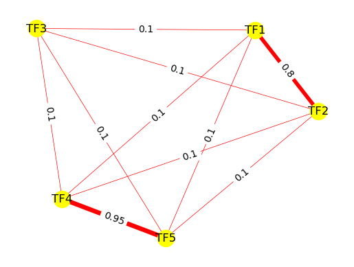
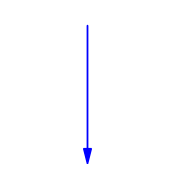
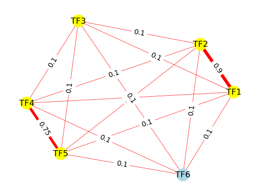
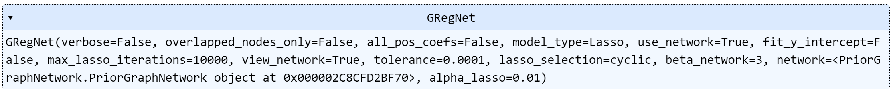

<!-- ---
layout: default
---

 -->

# NetREm

## GRegNet Gene Regular(ized/atory) Network

#### By: Saniya Khullar, Xiang Huang, John Svaren, Daifeng Wang
##### Daifeng Wang Lab

## Summary

NetREm is a software package that utilizes network-constrained regularization for biological applications and other network-based learning tasks. In biology, traditional regression methods can struggle with correlated predictors, particularly transcription factors (TFs) that regulate target genes in gene regulatory networks (GRNs). NetREm incorporates information from prior biological networks to improve predictions and identify complex relationships among predictors. This approach can highlight important nodes and edges in the network, reveal novel regularized embeddings for genes, provide insights into underlying biological processes, and improve model accuracy and biological/clinical significance of the models. NetREm can incorporate multiple types of network data, including Protein-Protein Interaction (PPI) networks, gene co-expression networks, and metabolic networks. 


<!-- GRegNet is a software package that utilizes network-constrained regularization for biological applications and other network-based learning tasks. In biology, traditional regression methods can struggle with correlated predictors, particularly transcription factors (TFs) that regulate target genes in gene regulatory networks (GRNs). GRegNet incorporates information from prior biological networks to improve predictions and identify complex relationships among predictors. This approach can highlight important nodes and edges in the network, provide insights into underlying biological processes, and improve model accuracy and biological/clinical significance of the models. GRegNet can incorporate multiple types of network data, including PPI networks, gene co-expression networks, and metabolic networks. -->

<!-- In summary, network-constrained regularization may bolster the construction of more accurate and interpretable models that incorporate prior knowledge of the network structure among predictors. -->

## Pipeline

*Pipeline image of NetREm*

## Hardware Requirements

Please note that larger prior graph networks may require more memory, space, and time. We anticipate that you would only need a standard computer (e.g. 32 GB RAM and 32 GB storage) with enough RAM to support the operations.

## Software Requirements

The analysis is based on Python version 3.10. Please ensure you have cloned or downloaded our NetREm Github code and package. 

In the Anaconda navigator prompt, you can create a virtual environment to run our code by running:
`conda create -n NetREm python=310`

Then, to activate this environment, please run:
`conda activate NetREm`

Please change the current directory to the NetREm folder by running `cd NetREm`. 

Then, please run the following command in the terminal or command prompt window to install the packages (and respective package versions and other dependencies) specified in our *requirements.txt* file: 
`pip install -r requirements.txt`

In short, we our code uses the following Python packages: *math, matplotlib, networkx, numpy, typing, os, pandas, plotly.express, random, scipy, scikit-optimize, sklearn, sys, tqdm, warnings*. 
<!-- To install these packages manually, please run *pip install [package]* or *pip3 install [package]* in the terminal or run *conda install [package]* in the Anaconda navigator prompt. -->


## Description of NetREm pipeline function: netrem

Please note that our package, NetRem, is run by the following function **netrem** in Python. Fits a Network-constrained Lasso regression machine learning model given an undirected prior weighted network and regularization parameters. If the input network is unweighted, please provide default weights greater than `default_edge_weight` in the `edge_list` parameter so that nodes that are connected in the network may contain higher weights and therefore more priority (otherwise, all nodes will be connected pairwise and have the same weights and that will render the network useless). 

<!-- SHould we have 2 arguments? 1 for default_edge_weight for nodes found in network. default_weight_prior_edges: for any edge in the edge_list that has an unknown weight, we provide this edge_weight. Thus, we are prioritizing edges provided in the edgelist over those not found in the edge_list originally. Then we can show that since we skipped out on sharing an edge, the code automatically added in an edge with lower edge weight.  
default_weight_new_edges. -->
## Usage

**netrem**(<br> 
                  &nbsp;&nbsp;&nbsp;&nbsp;&nbsp;&nbsp;*edge_list*, <br>
                  &nbsp;&nbsp;&nbsp;&nbsp;&nbsp;&nbsp;*gene_expression_nodes = []*, <br>
                  &nbsp;&nbsp;&nbsp;&nbsp;&nbsp;&nbsp;*overlapped_nodes_only = False*,<br>
                  &nbsp;&nbsp;&nbsp;&nbsp;&nbsp;&nbsp;*beta_net = 1*, <br>
                  &nbsp;&nbsp;&nbsp;&nbsp;&nbsp;&nbsp;*alpha_lasso = 0.01*, <br>
                  &nbsp;&nbsp;&nbsp;&nbsp;&nbsp;&nbsp;*model_type = "Lasso"*,<br>
                  &nbsp;&nbsp;&nbsp;&nbsp;&nbsp;&nbsp;*default_edge_weight = 0.1*,<br>
                  &nbsp;&nbsp;&nbsp;&nbsp;&nbsp;&nbsp;*degree_threshold = 0.5*,<br>
                  <!-- degree_pseudocount = 1e-3,<br> -->
                  &nbsp;&nbsp;&nbsp;&nbsp;&nbsp;&nbsp;*lasso_selection = "cyclic"*,<br>
                  &nbsp;&nbsp;&nbsp;&nbsp;&nbsp;&nbsp;*view_network = False*, <br>
                  &nbsp;&nbsp;&nbsp;&nbsp;&nbsp;&nbsp;*y_intercept = False*, <br>
                  &nbsp;&nbsp;&nbsp;&nbsp;&nbsp;&nbsp;*all_pos_coefs = False*,<br>
                  &nbsp;&nbsp;&nbsp;&nbsp;&nbsp;&nbsp;*tolerance = 1e-4*, <br>
                  &nbsp;&nbsp;&nbsp;&nbsp;&nbsp;&nbsp;*maxit = 10000*,<br>
                  &nbsp;&nbsp;&nbsp;&nbsp;&nbsp;&nbsp;*num_jobs = -1*,<br>
                  &nbsp;&nbsp;&nbsp;&nbsp;&nbsp;&nbsp;*num_cv_folds = 5*, <br>
                  &nbsp;&nbsp;&nbsp;&nbsp;&nbsp;&nbsp;*lassocv_eps = 1e-3*,<br>
                  &nbsp;&nbsp;&nbsp;&nbsp;&nbsp;&nbsp;*lassocv_n_alphas = 100*, <br>      
                  &nbsp;&nbsp;&nbsp;&nbsp;&nbsp;&nbsp;*lassocv_alphas = None*, <br>
                  &nbsp;&nbsp;&nbsp;&nbsp;&nbsp;&nbsp;*verbose = False*,<br>
                  &nbsp;&nbsp;&nbsp;&nbsp;&nbsp;&nbsp;*hide_warnings = True* <br>
                )

<!-- has 2 options with respect to the alpha_lasso_val ($\alpha_{lasso} \geq 0$) for the lasso regularization on the overall model: 
* default: the user may specify $\alpha_{lasso}$ manually (if *cv_for_alpha_lasso_model_bool = False*). If no alpha_lasso_val is specified, 0.1 will be used. 
* alternative: the user may opt for GRegulNet to select $\alpha_{lasso}$ based on cross-validation (CV) on training data (if *cv_for_alpha_lasso_model_bool = True*) -->

<!-- Ultimately, this function uses a prior network edge list and $\beta_{network}$ to build an estimator object from the class GRegulNet. This estimator can then take in input $X$ and $y$ data:  transforms them to $\tilde{X}$ and $\tilde{y}$, respectively, and use them to fit a Lasso regression model with a regularization value of $\alpha_{lasso}$. Overall, the trained model is more reflective of an underlying network structure among predictors and may be more biologically meaningful and interpretable.  -->


<!-- $$
\begin{cases}
  \text{geneRegulatNet(edge_list, } \beta_{network}, \text{cv_for_alpha_lasso_model_bool = } False, \alpha_{lasso}\text{)} & \text{if cv_for_alpha_lasso_model_bool = } False \\
  \text{geneRegulatNet(edge_list, } \beta_{network}, \text{cv_for_alpha_lasso_model_bool = } True) & \text{if cv_for_alpha_lasso_model_bool = } True \\
\end{cases}
$$

There are several additional parameters that can be adjusted in the geneRegulatNet function, which will be explained later in the *Default Parameters* section.  -->

<!-- ### Main Input: -->

<!-- * *edge_list*: A list of lists corresponding to a prior network involving the predictors (as nodes) and relationships among them as edges. We will utilize this prior network to constrain our machine learning model. For instance, this could be a Protein-Protein Interaction (PPI) network of interactions among the predictors. If  weights are missing for any edge, then the default_weight will be used for that respective edge. We assume that this network is undirected and thereby symmetric, so the user only needs to specify edges in 1 direction (and the other direction will be assumed automatically). 

For instance:

[[source<sub>1</sub>, target<sub>1</sub>, weight<sub>1</sub>], [source<sub>2</sub>, target<sub>2</sub>, weight<sub>2</sub>], ..., [source<sub>Z</sub>, target<sub>Z</sub>, weight<sub>Z</sub>]]. 

Where weight<sub>1</sub>, weight<sub>2</sub>, ..., weight<sub>Z</sub> are optional. If an edge is missing its respective edge weight, then the default edge weights will be utilized. 

The edge_list will be represented by:

| Source | Target |  Weight |
| --------- | ---------- | ---------- |
|source<sub>1</sub>   | target<sub>1</sub> | weight<sub>1</sub>|
|source<sub>2</sub>   | target<sub>2</sub> | weight<sub>2</sub> |
|...    | ... | ... |
|source<sub>Z</sub>    | target<sub>Z</sub> | weight<sub>Z</sub>|
|target<sub>1</sub>   | source<sub>1</sub> | weight<sub>1</sub> |
|target<sub>2</sub>    | source<sub>2</sub> | weight<sub>2</sub> |
|...    | ... | ... |
|target<sub>Z</sub>    | source<sub>Z</sub> | weight<sub>Z</sub> | -->

<!-- * *beta_network_val*:  A numerical value for $\beta_{network} \geq 0$.  -->

<!-- * *cv_for_alpha_lasso_model_bool*:
  - False (default): user wants to specify the value of $\alpha_{lasso}$
  - True: GRegulNet will perform cross-validation (CV) on training data to determine optimal $\alpha_{lasso}$ -->

<!-- $$ = \begin{cases}
  \text{if cv_for_alpha_lasso_model_bool = } False & \text{default: user wants to specify the value of }  \alpha_{lasso}  \\
  \text{if cv_for_alpha_lasso_model_bool = } True & \text{GRegulNet will perform cross-validation (CV) on training data to determine optimal } \alpha_{lasso} \\
\end{cases}
$$ -->

<!-- $$ = \begin{cases}
  \text{if cv_for_alpha_lasso_model_bool = } False & \text{default: user wants to specify the value of }  \alpha_{lasso}  \\
  \text{if cv_for_alpha_lasso_model_bool = } True & \text{GRegulNet will perform cross-validation (CV) on training data to determine optimal } \alpha_{lasso} \\
\end{cases}
$$ -->


<!-- ##### If *cv_for_alpha_lasso_model_bool* is False, we need to specify alpha_lasso_val $\alpha_{lasso}$ ##### -->

<!-- * *alpha_lasso_val*:  A numerical value for $\alpha_{lasso} \geq 0$. If *cv_for_alpha_lasso_model_bool* is False, the user is then advised to specify this $\alpha_{lasso}$ parameter (alpha_lasso_val). Otherwise, if no $\alpha_{lasso}$ value is specified, then the default value of $\alpha_{lasso} = 0.1$ will be used.  -->

### Main Inputs:

<!-- | Parameter | Definition | Default |
| --------- | ---------- | ---------- |
| edge_list       | list of lists: [[source<sub>1</sub>, target<sub>1</sub>, weight<sub>1</sub>], ..., [source<sub>Z</sub>, target<sub>Z</sub>, weight<sub>Z</sub>]] | value needed |
| $\beta_{network}$  | Regularization parameter for network penalization | value needed |
| cv_for_alpha_lasso_model_bool  | Should GRegulNet perform Cross Validation to determine $\alpha_{lasso}$  | False |
| $\alpha_{lasso}$  | Regularization parameter for lasso | value needed if cv_for_alpha_lasso_model_bool = False; default: 0.1 | -->


| Parameter | Definition | 
| --------- | ---------- | 
| **edge_list**      | ***list*** <br> A list of lists corresponding to a prior network involving predictors (nodes) and relationships among them (edges): <br> [[source<sub>1</sub>, target<sub>1</sub>, weight<sub>1</sub>], ..., [source<sub>Z</sub>, target<sub>Z</sub>, weight<sub>Z</sub>]]. Here, weight<sub>1</sub>, ..., weight<sub>Z</sub> are optional. Nodes found in the `edge_list` are referred to as *network nodes*| 
| **gene_expression_nodes**      | ***list, default = []*** <br> A list of predictors (e.g. TFs) to use that typically is found in the training gene expression data $X_{train}$. <br> Any `gene_expression_nodes` that are not found in the `edge_list` will be added into the network prior edge_list using default pairwise edge weights (`default_edge_weight`). This is *optional* but may boost the speed of training and fitting NetREm models (by adjusting the network prior in the beginning). Thus, if the gene expression data is available, it is recommended to input this list of `gene_expression_nodes` ahead of time. If not specified, then NetREm will automatically determine `gene_expression_nodes` when fitting the model with $X_{train}$ gene expression data (when the *fit(X,y)* method is called), but will need time to recalibrate the network prior. |
| **overlapped_nodes_only**      | ***boolean, default = False*** <br> This focuses on whether NetREm should focus on common nodes found in the *network nodes* (from the `edge_list`) and gene expression data (based on `gene_expression_nodes`). The priority is given to gene_expression_nodes since those have gene expression values that are used by the regression. <br> • If `overlapped_nodes_only = False`, the predictors used will come from `gene_expression_nodes`, even if those are not found in the network `edge_list`. This recognizes that not all predictors may have TF-TF relationships found in the prior network. <br> • If `overlapped_nodes_only = True`, the predictors used will need to be a common node: a *network node* that is also found in the `gene_expression_nodes`. <br> | 
| **beta_net** | ***float, default = 1*** <br> Regularization parameter for network penalization: $\beta_{net} \geq 0$. | 
| **model_type** | ***{'Lasso', 'LassoCV'}, default = 'Lasso'*** <br> • Lasso: user specifies value of $\alpha_{lasso}$ <br> • LassoCV: NetREm performs cross-validation (CV) on training data to determine optimal $\alpha_{lasso}$  | 
| **alpha_lasso**  | ***float, default = 0.01*** <br> A numerical regularization parameter for the lasso term ($\alpha_{lasso} \geq 0$) needed if `model_type = LassoCV`. Larger values typically reduce the number of final predictors in the model. |
| **y_intercept** | ***boolean, default = 'False'*** <br> Please note that this is the `fit_intercept` parameter found in the [Lasso](https://scikit-learn.org/stable/modules/generated/sklearn.linear_model.Lasso.html) and [LassoCV](https://scikit-learn.org/stable/modules/generated/sklearn.linear_model.LassoCV.html) classes in sklearn. <br> • If `y_intercept = True`, the model will be fit with a y-intercept term included. <br> • If `y_intercept = False`, the model will be fit with no y-intercept term. | 
| **all_pos_coefs** | ***boolean, default = 'False'*** <br> Please note that this is the `positive` parameter found in the [Lasso](https://scikit-learn.org/stable/modules/generated/sklearn.linear_model.Lasso.html) and [LassoCV](https://scikit-learn.org/stable/modules/generated/sklearn.linear_model.LassoCV.html) classes in sklearn. <br> • If `all_pos_coefs = True`, the model will be restricted to be fit with all regression coefficients as positive.  <br> • If `all_pos_coefs = False`, the model will be fit with no restrictions on regression coefficients.  | 
| **lasso_selection** | ***{'cyclic', 'random'}, default = 'cyclic'*** <br> Please note that this is the `selection` parameter found in the [Lasso](https://scikit-learn.org/stable/modules/generated/sklearn.linear_model.Lasso.html) and [LassoCV](https://scikit-learn.org/stable/modules/generated/sklearn.linear_model.LassoCV.html) classes in sklearn. | 
| **tolerance**  | ***float, default = 1e-4*** <br> The tolerance sklearn would use for optimizing the NetREm model. (This is known as `tol` in by Python's sklearn). If the updates to the optiimzation are smaller than `tolerance`, then the optimization code will check the dual gap for optimizality and contine the optimization until that dual gap is smaller than `tolerance`. |
| **maxit** | ***int, default = 10000*** <br> Please note that this is the `max_iter` parameter found in the [Lasso](https://scikit-learn.org/stable/modules/generated/sklearn.linear_model.Lasso.html) and [LassoCV](https://scikit-learn.org/stable/modules/generated/sklearn.linear_model.LassoCV.html) classes in sklearn. This is the maximum number of iterations that NetREm will perform. | 


* Parameters if `model_type = LassoCV` are derived from the [LassoCV](https://scikit-learn.org/stable/modules/generated/sklearn.linear_model.LassoCV.html) class in sklearn:

| Parameter | Definition | 
| --------- | ---------- | 
| lassocv_eps  | ***float, default = 1e-3*** <br>  This corresponds to the `eps` epsilon parameter in [LassoCV](https://scikit-learn.org/stable/modules/generated/sklearn.linear_model.LassoCV.html). It is the length of the path. Here, `lassocv_eps = 1e-3` means that `alpha_min / alpha_max = 1e-3`. | 
| lassocv_n_alphas  | ***int, default = 100*** <br> This corresponds to the `n_alphas` parameter in [LassoCV](https://scikit-learn.org/stable/modules/generated/sklearn.linear_model.LassoCV.html).  This is the number of alphas along the Lasso regularization path. |
| lassocv_alphas  |  ***array-like, default = None*** <br>  This corresponds to the `alphas` parameter in [LassoCV](https://scikit-learn.org/stable/modules/generated/sklearn.linear_model.LassoCV.html). List of alphas where the models to be computed. If `None` then the alphas are set automatically. |
| num_cv_folds  |  ***float, default = 5*** <br>  By default, sklearn cross-validation is used. This specifies the number of folds for splitting the training data when fitting the NetREm model. |
| num_jobs | ***int, default = -1*** <br> Number of jobs to run in parallel. None means 1 unless in a joblib.parallel_backend context. -1 means using all of the processors. This is similar to the `n_jobs` parameter in sklearn. |
<!-- | Parameter | Definition | 
| --------- | ---------- | 
| $X$ | Input numpy array matrix (list of lists) each list corresponds to a sample. Here, rows are samples and columns are predictors. | 
| $y$ | Input numpy array list with 1 value for each sample.|  -->


<!-- | Parameter | Definition | More information |
| --------- | ---------- | ---------- |
| edge_list       | A list of lists corresponding to a prior network involving predictors (nodes) and relationships among them (edges): [[source<sub>1</sub>, target<sub>1</sub>, weight<sub>1</sub>], ..., [source<sub>Z</sub>, target<sub>Z</sub>, weight<sub>Z</sub>]]. Here, weight<sub>1</sub>, ..., weight<sub>Z</sub> are optional. | This prior network constrains our model. We assume that this network is undirected and thereby symmetric, so the user only needs to specify edges in 1 direction (and other directions are assumed automatically). The default edge weight is utilized for any edge with a missing edge weight.|
| beta_network_val: $\beta_{network}$  | Regularization parameter for network penalization: $\beta_{network} \geq 0$. | Value needed, which scales the strength of network penalization |
| cv_for_alpha_lasso_model_bool  | Should GRegulNet perform Cross Validation to determine $\alpha_{lasso}$? | Default boolean value: False. <br>* False (default): user wants to specify the value of $\alpha_{lasso}$ <br> * True: GRegulNet will perform cross-validation (CV) on training data to determine optimal $\alpha_{lasso}$  |
| alpha_lasso_val: $\alpha_{lasso}$  | A numerical regularization parameter for lasso: $\alpha_{lasso} \geq 0$. | Value needed if cv_for_alpha_lasso_model_bool = False; default: 0.1 |
  -->


* Parameters for the graph prior network:

<!-- | Parameters: |  | 
| --------- | ---------- | -->

## Parameters

<!-- | Parameter           | Description                                                                                                                      |
|---------------------|----------------------------------------------------------------------------------------------------------------------------------|
| **param_grid**      | Dictionary or list of dictionaries with parameters names (string) as keys and lists of parameter settings to try as values.      |
| **scoring**         | A single string or a callable to evaluate the predictions on the test set. If None, the estimator's default scorer is used.       |
| **cv**              | Determines the cross-validation splitting strategy. Possible inputs are:<br> - None: to use the default 5-fold cross-validation<br> - integer: to specify the number of folds in a `(Stratified)KFold`<br> - an object to be used as a cross-validation generator. |
| **verbose**         | Controls the verbosity: the higher, the more messages.                                                                           |
| **n_jobs**          | Number of jobs to run in parallel.                                                                                              |
| **refit**           | If set to True, refit an estimator using the best found parameters on the whole dataset.                                         |
| **return_train_score** | If `False`, the `cv_results_` attribute will not include training scores.                                                        |
| **pre_dispatch**    | Controls the number of jobs that get dispatched during parallel execution.                                                        |
| **error_score**     | Value to assign to the score if an error occurs in estimator fitting.                                                            |
                                                         | -->


| Parameter | Definition | 
| --------- | ---------- | 
| default_edge_weight  | ***float, default = 0.1*** <br>  Default edge weight ($w$) assigned to any edge with missing weight | 
| degree_threshold  |  ***float, default = 0.5*** <br>  Edges with weight $w$ > degree_threshold are counted as 1 towards node degree |
| view_network  |  ***boolean, default = False*** <br>  • If `view_network = True`, then NetREm outputs visualizations of the prior graph network. Recommended for small networks (instead of dense hairballs) <br> If `view_network = False`, then NetREm saves time by not outputting visuals of the network.  |

<!-- | degree_threshold  | Edges with weight $w$ > degree_threshold are counted as 1 towards node degree (if *edge_vals_for_d is False*) | -->
<!-- | sqrt_w_for_d  | Sum $\sqrt{w}$ for a given node degree (if *edge_vals_for_d is True*) |
| square_w_for_d  | Sum $w^{2}$ for a given node degree (if *edge_vals_for_d is True*) | -->
 <!-- self_loops  | True: Add 1 to each degree ($d$) for each node in the network (for self-loops)| 
 | edge_vals_for_d  | True: edge weights $w$ used for node degree; False: threshold used | default: False| -->
<!-- | w_transform_for_d | To calculate degree for a given node, we can choose from 1 of 3 options (if *edge_vals_for_d is True*): <br> * "none": sum original $w$ <br> * "sqrt": sum $\sqrt{w}$ <br> * "square": sum $w^{2}$ |  -->

<!-- * Parameters for the network-based regularized model:

| Parameter | Definition | 
| --------- | ---------- | 
| use_net  | * True: use a prior graph network for regularization. <br> * False: fit a Lasso model on original $X$ and $y$ data (baseline). | 
| y_intercept | * True: y-intercept is fitted for the final NetREm model. <br> * False: no y-intercept is fitted (model coefficients are only for predictors)| 
| maxit  | the maximum # of iterations we will run Lasso regression model for (if `model_type = LassoCV`) |
| num_cv_folds  | # of cross-validation (cv) folds we fit on training data during model building (if `model_type = LassoCV`) | -->


### Details:

 We input an edge list of the prior graph network (constrains the model via network-based regularization) and a beta_network_val ($\beta_{net} \geq 0$, which scales the network-based regularization penalty). The user may specify the alpha_lasso_val ($\alpha_{lasso} \geq 0$) manually for the lasso regularization on the overall model (if *model_type = Lasso*) or NetREm may select an optimal $\alpha_{lasso}$ based on cross-validation (CV) on the training data (if `model_type = LasssoCV`). Then, **netrem** builds an estimator object from the class Netrem that can then take in input $X$ and $y$ data: transforms them to $\tilde{X}$ and $\tilde{y}$, respectively, and use them to fit a Lasso regression model with a regularization value of $\alpha_{lasso}$. Ultimately, the trained NetREm model is more reflective of an underlying network structure among predictors and may be more biologically meaningful and interpretable. 

### Output Values: ###

* A NetREm network-regularized linear model estimator object from the NetREmModel class. There are several methods we can call for our NetREm estimator object:

#### Methods:

* **fit($X$, $y$)**

Building and training the NetREm model with $X$ and $y$ data. 

| Parameter | Definition | 
| --------- | ---------- | 
| $X$ | Input numpy array matrix (list of lists) where each list corresponds to a sample used for training. Here, rows are samples and columns are predictors. | 
| $y$ | Input numpy array list for model training with 1 value for each sample.| 


We can retrieve our model coefficients and other attributes by calling these outputs:

| Output | Definition | 
| --------- | ---------- | 
| model_coef_df  | Pandas dataframe of the Lasso model coefficients for the predictors and y-intercept (if `y_intercept = True`) | 
| optimal_alpha  | If `model_type = LassoCV`, returns the optimal $\alpha_{lasso}$ found by performing cross validation (CV) on training data | 
| all_params_list  | List of lists of the parameters used for NetREm model (defensive programming) | 
| params_df | Pandas dataframe of the parameters used for NetREm model (defensive programming) | 
| mse_train | Mean Square Error (MSE): predicted versus actual values | 

* **predict($X$)**

We can use our model to predict values for our response variable $y$. 

| Parameter | Definition | 
| --------- | ---------- | 
| $X$ | Input numpy array matrix (list of lists) where each list corresponds to a sample. Here, rows are samples and columns are predictors. | 

*Returns:*
  Numpy array of $\hat{y}$ predicted values for $y$.

* **test_mse($X$, $y$)**

We can evaluate our model performance capabilities on data like testing data using the Mean Squared Error (MSE) as our metric. 

| Parameter | Definition | 
| --------- | ---------- | 
| $X$ | Numpy array matrix (list of lists) where each list corresponds to a sample. Here, rows are samples and columns are predictors. | 
| $y$ | Numpy array list for response variable with 1 value for each sample.| 

*Returns:*
    Numeric value corresponding to the Mean Square Error (MSE). 
  
$$MSE = \frac{1}{m} \sum_{i=1}^m (y_i - \hat{y_i})^2$$

## Demo (Toy Example) of NetREm:

Please suppose that we want to build a machine learning model to predict the gene expression level of our target gene (TG) $y$ based on the expression levels of 6 Transcription Factors (TFs): [TF<sub>1</sub>, $TF_{2}$, $TF_{3}$, $TF_{4}$, $TF_{5}$, $TF_{6}$], which are our respective predictors [X<sub>1</sub>, $X_{2}$, $X_{3}$, $X_{4}$, $X_{5}$, $X_{6}$]. We generate 100 random samples (rows) of data where the Pearson correlations ($r$) of predictors with $y$ are *corrVals*: [cor(TF<sub>1</sub>, $y$) = 0.9, cor(TF<sub>2</sub>, $y$) = 0.5, cor(TF<sub>3</sub>, $y$) = 0.1, cor(TF<sub>4</sub>, $y$) = -0.2, cor(TF<sub>5</sub>, $y$) = -0.8,  cor(TF<sub>6</sub>, $y$) = -0.3]. The dimensions of $X$ are therefore 100 rows by 6 columns (predictors). More details about our *generate_dummy_data* function (and additional parameters we can adjust for) are in *Dummy_Data_Demo_Example.ipynb*. Our NetREm estimator also incorporates an **undirected weighted prior graph network** of biological relationships among only 5 TFs based on a weighted Protein-Protein Interaction (PPI) network ([TF<sub>1</sub>, $TF_{2}$, $TF_{3}$, $TF_{4}$, $TF_{5}$]), where higher edge weights $w$ indicate stronger biological interactions at the protein-level. :star:

```python
# Please load our code for NetREm from the code folder
from packages_needed import *
import error_metrics as em 
from packages_needed import *
import Netrem_model_builder as nm
import DemoDataBuilderXandY as demo
import PriorGraphNetwork as graph
import netrem_evaluation_functions as nm_eval
import essential_functions as ef

dummy_data = demo.generate_dummy_data(corrVals = [0.9, 0.5, 0.1, -0.2, -0.8, -0.3],
                   num_samples_M = 100,
                   train_data_percent = 70)

X_df = dummy_data.X_df
X_df.head()
```

    :) same_train_test_data = False
    :) Please note that since we hold out 30.0% of our 100 samples for testing, we have:
    :) X_train = 70 rows (samples) and 6 columns (N = 6 predictors) for training.
    :) X_test = 30 rows (samples) and 6 columns (N = 6 predictors) for testing.
    :) y_train = 70 corresponding rows (samples) for training.
    :) y_test = 30 corresponding rows (samples) for testing.


<div>
<table border="1" class="dataframe">
  <thead>
    <tr style="text-align: right;">
      <th></th>
      <th>TF1</th>
      <th>TF2</th>
      <th>TF3</th>
      <th>TF4</th>
      <th>TF5</th>
      <th>TF6</th>
    </tr>
  </thead>
  <tbody>
    <tr>
      <th>0</th>
      <td>2.020840</td>
      <td>0.594445</td>
      <td>-1.443012</td>
      <td>-0.688777</td>
      <td>0.900770</td>
      <td>-2.643671</td>
    </tr>
    <tr>
      <th>1</th>
      <td>3.224776</td>
      <td>-0.270632</td>
      <td>-0.557771</td>
      <td>-0.305574</td>
      <td>0.054708</td>
      <td>-1.054197</td>
    </tr>
    <tr>
      <th>2</th>
      <td>-2.746721</td>
      <td>1.502236</td>
      <td>2.043813</td>
      <td>1.252975</td>
      <td>2.082159</td>
      <td>1.227615</td>
    </tr>
    <tr>
      <th>3</th>
      <td>-0.558130</td>
      <td>1.290771</td>
      <td>-1.230527</td>
      <td>-0.678410</td>
      <td>0.630084</td>
      <td>-1.508758</td>
    </tr>
    <tr>
      <th>4</th>
      <td>-2.181462</td>
      <td>-0.657229</td>
      <td>-2.880186</td>
      <td>-1.629470</td>
      <td>0.268042</td>
      <td>1.207254</td>
    </tr>
  </tbody>
</table>
</div>


```python
y_df = dummy_data.y_df
y_df.head()
```


<div>
<table border="1" class="dataframe">
  <thead>
    <tr style="text-align: right;">
      <th></th>
      <th>y</th>
    </tr>
  </thead>
  <tbody>
    <tr>
      <th>0</th>
      <td>0.601721</td>
    </tr>
    <tr>
      <th>1</th>
      <td>1.151619</td>
    </tr>
    <tr>
      <th>2</th>
      <td>-1.359462</td>
    </tr>
    <tr>
      <th>3</th>
      <td>0.222055</td>
    </tr>
    <tr>
      <th>4</th>
      <td>-0.775868</td>
    </tr>
  </tbody>
</table>
</div>

```python
# 70 samples for training data (used to train and fit GRegulNet model)
X_train = dummy_data.view_X_train_df()
y_train = dummy_data.view_y_train_df()

# 30 samples for testing data
X_test = dummy_data.view_X_test_df()
y_test = dummy_data.view_y_test_df()

# prior network edge_list:
edge_list = [["TF1", "TF2", 0.9], ["TF4", "TF5", 0.75], ["TF1", "TF3"], ["TF1", "TF4"], ["TF1", "TF5"], 
              ["TF2", "TF3"], ["TF2", "TF4"], ["TF2", "TF5"], ["TF3", "TF4"], ["TF3", "TF5"]]

beta_network_val = 3 
# by default, cv_for_alpha is False, so alpha_lasso_val will be specified for the alpha_lasso parameter.
alpha_lasso_val = 0.01

# Building the network regularized regression model: 
# Please note: To include nodes found in the gene expression data that are not found in the PPI Network (e.g. TF6 in our case), we use False for the overlapped_nodes_only argument (otherwise, we would only use TFs 1 to 5):
netrem_demo = nm.netrem(edge_list = edge_list, 
                                beta_net = beta_network_val,
                                alpha_lasso = alpha_lasso_val,
                                overlapped_nodes_only = False, # so we include TF6
                                view_network = True)

# Fitting the gregulnet model on training data: X_train and y_train:
netrem_demo.fit(X_train, y_train)
```

    Please note that we need to update the network information
    


    

    


    

    


    :) 1 new nodes added to network based on gene expression data ['TF6']
    

    




<!-- There is a particularly strong relationship between $TF_{1} \leftrightarrow TF_{2}$ of 0.9 and between $TF_{4} \leftrightarrow TF_{5}$ of 0.75. The remaining relationships among the other TFs is assumed to be the default (edge weight of 0.1). -->
<!-- Here, $gregulnet_{demo}$ is an object of the *GRegulNet* class. We fit a model using $X_{train}$ and $y_{train}$ data (70 samples). -->

To view and extract the predicted model coefficients for the predictors: 

<!-- ```python
gregulnet_demo.coef
```

    array([ 0.23655573,  0.11430656,  0.00148755, -0.03512912, -0.16009479]) -->


```python
netrem_demo.model_coef_df
```

<!-- <div>
<table border="1" class="dataframe">
  <thead>
    <tr style="text-align: right;">
      <th></th>
      <th>y_intercept</th>
      <th>TF1</th>
      <th>TF2</th>
      <th>TF3</th>
      <th>TF4</th>
      <th>TF5</th>
    </tr>
  </thead>
  <tbody>
    <tr>
      <th>0</th>
      <td>None</td>
      <td>0.236556</td>
      <td>0.114307</td>
      <td>0.001488</td>
      <td>-0.035129</td>
      <td>-0.160095</td>
    </tr>
  </tbody>
</table>
</div> -->

<div>
<table border="1" class="dataframe">
  <thead>
    <tr style="text-align: right;">
      <th></th>
      <th>y_intercept</th>
      <th>TF1</th>
      <th>TF2</th>
      <th>TF3</th>
      <th>TF4</th>
      <th>TF5</th>
      <th>TF6</th>
    </tr>
  </thead>
  <tbody>
    <tr>
      <th>0</th>
      <td>None</td>
      <td>0.309776</td>
      <td>0.112297</td>
      <td>0.001116</td>
      <td>-0.073603</td>
      <td>-0.21665</td>
      <td>0.000375</td>
    </tr>
  </tbody>
</table>
</div>

To view the cell-type-specific Protein-Protein Interactions (PPIs) that NetREm learned for this target gene $y$, please note that we can view the B_interaction_df. 

```python
netrem_demo.B_interaction_df
```

<div>
<table border="1" class="dataframe">
  <thead>
    <tr style="text-align: right;">
      <th></th>
      <th>TF1</th>
      <th>TF2</th>
      <th>TF3</th>
      <th>TF4</th>
      <th>TF5</th>
      <th>TF6</th>
    </tr>
  </thead>
  <tbody>
    <tr>
      <th>TF1</th>
      <td>4.512391</td>
      <td>0.856197</td>
      <td>-0.515540</td>
      <td>-0.262458</td>
      <td>-2.315411</td>
      <td>-1.166994</td>
    </tr>
    <tr>
      <th>TF2</th>
      <td>0.856197</td>
      <td>1.644936</td>
      <td>-0.342697</td>
      <td>0.169874</td>
      <td>-0.570895</td>
      <td>-0.494075</td>
    </tr>
    <tr>
      <th>TF3</th>
      <td>-0.515540</td>
      <td>-0.342697</td>
      <td>84.228863</td>
      <td>-0.470847</td>
      <td>-0.618672</td>
      <td>-16.642297</td>
    </tr>
    <tr>
      <th>TF4</th>
      <td>-0.262458</td>
      <td>0.169874</td>
      <td>-0.470847</td>
      <td>1.218198</td>
      <td>0.070268</td>
      <td>-0.619841</td>
    </tr>
    <tr>
      <th>TF5</th>
      <td>-2.315411</td>
      <td>-0.570895</td>
      <td>-0.618672</td>
      <td>0.070268</td>
      <td>2.505441</td>
      <td>-0.163531</td>
    </tr>
    <tr>
      <th>TF6</th>
      <td>-1.166994</td>
      <td>-0.494075</td>
      <td>-16.642297</td>
      <td>-0.619841</td>
      <td>-0.163531</td>
      <td>84.577403</td>
    </tr>
  </tbody>
</table>
</div>


We can test the performance of our data on testing data (30 samples), to understand better the generalizability of our NetREm model on new, unseen, data. 


```python
pred_y_test = netrem_demo.predict(X_test) # predicted values for y_test
mse_test = netrem_demo.test_mse(X_test, y_test)

print(f"Please note that the testing Mean Square Error (MSE) is {mse_test}")
```

    :) Please note that the testing Mean Square Error (MSE) is 0.10939471847175668

    


<!-- ### Comparison Demo: GRegulNet versus Baseline Model for Cross-Validation Alpha Lasso

We will use the same $X_{train}$, $y_{train}$, $X_{test}$, and $y_{test}$ data and same prior network here to compare illustrate the effectiveness of GRegulNet in terms of a lower testing MSE (relative to a baseline model that incorporates no prior network). For ease of comparison, we will select the optimal alpha_lasso for each model using cross validation (CV) on the training data (that is, *cv_for_alpha_lasso_model_bool* = True). This example also shows how to run **geneRegulatNet** when alpha_lasso is determined by CV. 

#### GRegulNet using Cross validation for Alpha Lasso 
```python
# geneRegulatNet where alpha_lasso is determined by cross-validation on training data: :)
gregulnet_cv_demo = geneRegulatNet(edge_list = edge_list, beta_network_val = 10,
                              alpha_lasso_val = alpha_lasso_val, 
                              cv_for_alpha_lasso_model_bool = True)
gregulnet_cv_demo.fit(X_train, y_train)
print(gregulnet_cv_demo.optimal_alpha)
gregulnet_cv_mse_test = gregulnet_cv_demo.predict(X_test, y_test)
print(f"Please note that the testing Mean Square Error (MSE) for GRegulNet-CV model is {gregulnet_cv_mse_test}")
gregulnet_cv_demo.model_coefficients_df
```

    prior graph network used
    :) Please note that we count the number of edges with weight > 0.5 to get the degree for a given node.
    :) We also add 0.001 as a pseudocount to our degree value for each node.
    
    network used
    Training GRegulNet :)
    Cross-Validation optimal alpha lasso: 0.0041235620913686235
    Testing GRegulnet :)
    Please note that the testing Mean Square Error (MSE) for GRegulNet-CV model is 0.020310913421979375
    

<div>
<table border="1" class="dataframe">
  <thead>
    <tr style="text-align: right;">
      <th></th>
      <th>y_intercept</th>
      <th>TF1</th>
      <th>TF2</th>
      <th>TF3</th>
      <th>TF4</th>
      <th>TF5</th>
    </tr>
  </thead>
  <tbody>
    <tr>
      <th>0</th>
      <td>None</td>
      <td>0.236283</td>
      <td>0.116051</td>
      <td>0.001487</td>
      <td>-0.037593</td>
      <td>-0.161468</td>
    </tr>
  </tbody>
</table>
</div>

    
<!--  -->
    
<!-- 
#### Baseline Model using Cross validation for Alpha Lasso 
```python
# baseline lasso model (no prior network). Optimal alpha_lasso determined by cross-validation
# on the training data: :)
baseline_demo = geneRegulatNet(edge_list = edge_list, beta_network_val = None,
                              alpha_lasso_val = alpha_lasso_val, 
                              cv_for_alpha_lasso_model_bool = True,
                              use_network = False)

baseline_demo.fit(X_train, y_train)
print(baseline_demo.optimal_alpha)
baseline_mse_test = baseline_demo.predict(X_test, y_test)
print(f"Please note that the testing Mean Square Error (MSE) for the baseline model is {baseline_mse_test}")
baseline_demo.model_coefficients_df
```

    baseline model (no prior network)
    Cross-Validation optimal alpha lasso: 0.022006210642838385
    Please note that the testing Mean Square Error (MSE) for the baseline model is 0.1630541856987722
    
<div>
<table border="1" class="dataframe">
  <thead>
    <tr style="text-align: right;">
      <th></th>
      <th>y_intercept</th>
      <th>TF1</th>
      <th>TF2</th>
      <th>TF3</th>
      <th>TF4</th>
      <th>TF5</th>
    </tr>
  </thead>
  <tbody>
    <tr>
      <th>0</th>
      <td>None</td>
      <td>0.256041</td>
      <td>0.036381</td>
      <td>0.076338</td>
      <td>0</td>
      <td>-0.208916</td>
    </tr>
  </tbody>
</table>
</div> --> 

## References

[1]: Caiyan Li, Hongzhe Li, Network-constrained regularization and variable selection for analysis of genomic data, Bioinformatics, Volume 24, Issue 9, May 2008, Pages 1175–1182, https://doi.org/10.1093/bioinformatics/btn081

[2]: Wilkinson, M.D., Dumontier, M., Aalbersberg, I.J. et al. The FAIR Guiding Principles for scientific data management and stewardship. Sci Data 3, 160018 (2016). https://doi.org/10.1038/sdata.2016.18

[3]: Zhang, Y., Akutsu, T., & Ching, W. K. (2016). Incorporating network topology and phylogenetic constraints for protein-protein interaction prediction. BMC bioinformatics, 17(1), 1-15. https://doi.org/10.1186/s12859-016-1310-4

[4]: Jia, C., Zhang, Y., Chen, K., & Zhang, S. (2018). A novel feature extraction method with improved consistency for identifying cell cycle regulated genes. Bioinformatics, 34(5), 896-903. https://doi.org/10.1093/bioinformatics/btx657

[5]: Lu, Y., Chen, X., & Hu, Z. (2017). Recognition of protein/gene names from text using an ensemble of classifiers and effective abbreviation resolution. BMC bioinformatics, 18(1), 1-11. https://doi.org/10.1186/s12859-017-1515-1

[6]: Pedregosa, F., Varoquaux, G., Gramfort, A., Michel, V., Thirion, B., Grisel, O., ... & Vanderplas, J. (2011). Scikit-learn: Machine learning in Python. Journal of Machine Learning Research, 12(Oct), 2825-2830.
